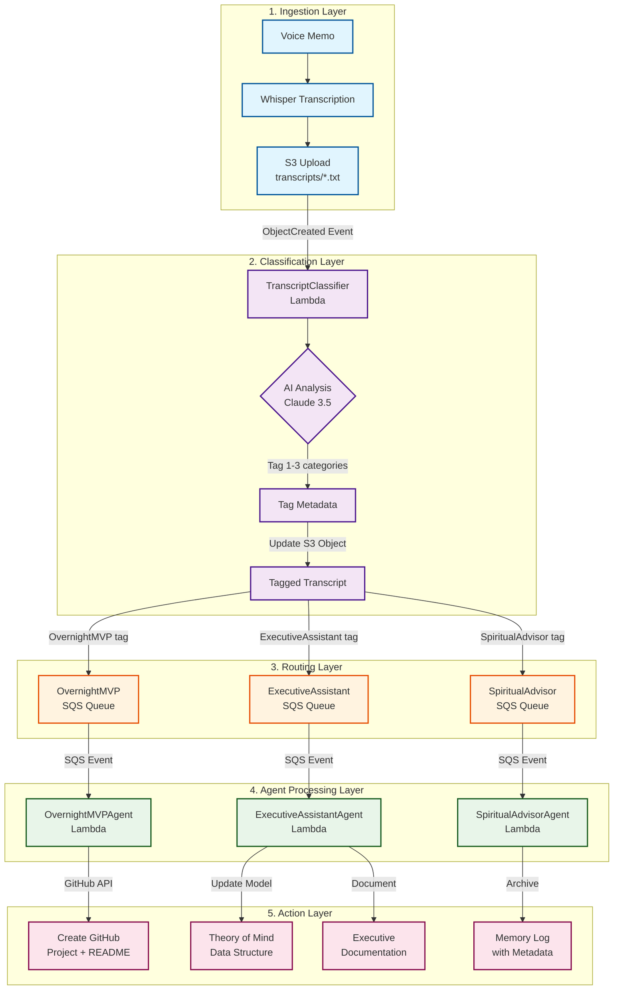

# WhisperSync Agent Architecture

## System Overview



## Detailed Flow

### Step 1: Voice Recording & Upload
```
User records voice memo → Whisper transcribes → Upload to S3
```

### Step 2: Intelligent Classification
When a transcript lands in S3, the TranscriptClassifier Lambda:
1. Downloads the transcript
2. Analyzes with Claude 3.5 Sonnet
3. Assigns 1-3 category tags (strongly biased toward single tag)
4. Updates S3 object metadata with tags

### Step 3: Queue Routing
Based on tags, messages are sent to appropriate SQS queues:
- **OvernightMVP** → Ideas, projects, technical innovations
- **ExecutiveAssistant** → Work tasks, meetings, professional updates
- **SpiritualAdvisor** → Personal reflections, memories, life events

### Step 4: Agent Processing

## The Three Agents

### 🚀 OvernightMVPAgent
**Purpose**: Transform ideas into actionable GitHub projects

**MVP Functionality**:
```python
# Core actions:
1. Parse idea from transcript
2. Generate project name and description
3. Create GitHub repository
4. Generate README.md with:
   - Project vision
   - MVP architecture (AWS-focused)
   - Technical approach
   - Initial milestones
```

**Example Output**:
```markdown
# voice-activated-mood-tracker

## Vision
A mobile app that tracks mood through voice analysis...

## MVP Architecture (AWS)
- Lambda: Voice processing pipeline
- DynamoDB: Mood history storage
- Bedrock: Sentiment analysis
- S3: Audio storage
- API Gateway: Mobile app integration

## Technical Approach
1. Record 30-second voice samples
2. Analyze tone, pace, word choice
3. Generate mood score and insights
...
```

### 📊 ExecutiveAssistantAgent
**Purpose**: Intelligent professional life management with evolving self-model

**Theory of Mind Data Structure**:
```python
{
    "identity": {
        "core_values": ["innovation", "efficiency", "growth"],
        "professional_identity": "Senior engineer transitioning to leadership",
        "skills_focus": ["AI/ML", "cloud architecture", "team building"],
        "last_updated": "2024-01-15",
        "confidence": 0.85
    },
    "temporal_context": {
        "current_week": {
            "week_of": "2024-01-15",
            "stated_goals": ["Complete API redesign", "1:1 with team"],
            "detected_themes": ["delegation", "technical debt"],
            "energy_level": "moderate"
        },
        "current_quarter": {
            "projects": ["Platform migration", "Team expansion"],
            "key_relationships": {
                "boss": {"name": "Sarah", "sentiment": "positive", "recent_topics": ["promotion", "budget"]},
                "clients": ["Acme Corp", "TechStart Inc"],
                "team": ["Alex", "Jordan", "Sam"]
            }
        },
        "long_term_arcs": {
            "consulting_business": {"status": "active", "hours_per_week": 10},
            "richmond_network": {"last_event": "2024-01-10", "connections": 47},
            "career_trajectory": "IC → Tech Lead → Engineering Manager"
        }
    },
    "decision_model": {
        "time_allocation_preferences": {
            "deep_work": 0.4,
            "meetings": 0.3,
            "learning": 0.2,
            "networking": 0.1
        },
        "project_evaluation_criteria": [
            "alignment_with_goals",
            "team_impact",
            "learning_opportunity",
            "career_advancement"
        ]
    }
}
```

**MVP Functionality**:
1. Parse transcript for professional content
2. Update theory of mind if significant changes detected
3. Create executive summary with context
4. Flag items needing attention

### 🧘 SpiritualAdvisorAgent
**Purpose**: Preserve memories with deep personal context

**Context Awareness**:
- Personal struggles (divorce, narcolepsy)
- Emotional patterns and growth
- Relationships and their evolution
- Life lessons and wisdom gained

**MVP Functionality**:
```python
# Memory log entry structure:
{
    "timestamp": "2024-01-15T14:30:00Z",
    "transcript": "Original voice memo text...",
    "interpretation": {
        "surface_content": "Talked about feeling tired at work",
        "deeper_context": "Narcolepsy flare-up during stressful project",
        "emotional_state": "Frustrated but determined",
        "life_phase": "Post-divorce adjustment, finding new rhythm"
    },
    "themes": ["resilience", "health", "work-life-balance"],
    "connections": ["Similar struggle on 2023-12-01", "Progress since divorce"],
    "wisdom": "Recognizing physical limits as strength, not weakness",
    "metadata": {
        "significance_score": 0.7,
        "privacy_level": "personal",
        "review_date": "2024-04-15"  # 3 months later
    }
}
```

## Implementation Architecture

### Classification Tags
```python
CATEGORY_TAGS = {
    "OvernightMVP": {
        "keywords": ["idea", "build", "app", "tool", "what if", "project"],
        "patterns": ["technical innovation", "product concept", "solution design"]
    },
    "ExecutiveAssistant": {
        "keywords": ["meeting", "deadline", "client", "team", "project update"],
        "patterns": ["work task", "professional relationship", "career decision"]
    },
    "SpiritualAdvisor": {
        "keywords": ["feel", "remember", "realized", "grateful", "struggling"],
        "patterns": ["personal reflection", "emotional processing", "life event"]
    }
}
```

### SQS Queue Configuration
```python
# Dead letter queues for reliability
overnight_mvp_dlq = Queue(self, "OvernightMVP-DLQ",
    retention_period=Duration.days(14)
)

overnight_mvp_queue = Queue(self, "OvernightMVP-Queue",
    visibility_timeout=Duration.minutes(15),  # Time to process
    dead_letter_queue=DeadLetterQueue(
        max_receive_count=3,
        queue=overnight_mvp_dlq
    )
)

# Similar for other queues...
```

### Lambda Agent Configuration
```python
overnight_mvp_agent = Function(self, "OvernightMVPAgent",
    runtime=Runtime.PYTHON_3_11,
    handler="agents.overnight_mvp.handler",
    timeout=Duration.minutes(10),  # GitHub operations can be slow
    memory_size=512,
    environment={
        "GITHUB_TOKEN_SECRET": "github/personal_token",
        "DEFAULT_REPO_VISIBILITY": "public",
        "README_TEMPLATE_BUCKET": bucket.bucket_name
    }
)

# Grant permissions
github_secret.grant_read(overnight_mvp_agent)
overnight_mvp_queue.grant_consume_messages(overnight_mvp_agent)
```

## Data Flow Examples

### Example 1: Project Idea
```
Transcript: "I have an idea for an app that helps people find hiking buddies"
→ Tagged: ["OvernightMVP"]
→ Queue: OvernightMVP
→ Result: GitHub repo "hiking-buddy-finder" with AWS architecture
```

### Example 2: Work Update
```
Transcript: "Meeting with Sarah went well, we're moving forward with the platform migration"
→ Tagged: ["ExecutiveAssistant"]
→ Queue: ExecutiveAssistant
→ Result: Updates boss relationship, confirms Q1 project on track
```

### Example 3: Personal Reflection
```
Transcript: "Feeling exhausted today but proud I finished the presentation despite everything"
→ Tagged: ["ExecutiveAssistant", "SpiritualAdvisor"]
→ Queues: Both
→ Results: 
  - EA: Notes presentation completion, detects low energy
  - SA: Captures resilience theme, links to narcolepsy context
```

## Future Enhancements

### ExecutiveAssistant Sub-Agents
```
┌─────────────────────────────────────┐
│    ExecutiveAssistantAgent          │
├─────────────────────────────────────┤
│  ┌─────────────┐ ┌─────────────┐   │
│  │CalendarAgent│ │ GoalsAgent  │   │
│  └─────────────┘ └─────────────┘   │
│  ┌─────────────┐ ┌─────────────┐   │
│  │NetworkAgent │ │ EnergyAgent │   │
│  └─────────────┘ └─────────────┘   │
└─────────────────────────────────────┘

Each sub-agent provides perspective:
- CalendarAgent: "No time for new projects this week"
- GoalsAgent: "Aligns with Q2 learning objectives"
- NetworkAgent: "Could strengthen connection with Richmond Python group"
- EnergyAgent: "Low capacity - delegate or defer"
```

### Cross-Agent Intelligence
- OvernightMVP ↔ ExecutiveAssistant: "New project idea but calendar is full"
- ExecutiveAssistant ↔ SpiritualAdvisor: "Work stress patterns affecting health"
- All agents share context for holistic understanding

## Configuration

### Environment Variables
```bash
# TranscriptClassifier
ANTHROPIC_API_KEY_SECRET=anthropic/api_key
CLASSIFICATION_CONFIDENCE_THRESHOLD=0.7
MAX_TAGS_PER_TRANSCRIPT=3

# OvernightMVPAgent
GITHUB_TOKEN_SECRET=github/personal_token
DEFAULT_README_TEMPLATE=s3://bucket/templates/mvp_readme.md

# ExecutiveAssistantAgent
THEORY_OF_MIND_TABLE=ExecutiveAssistant-TheoryOfMind
CALENDAR_API_KEY_SECRET=google/calendar_api

# SpiritualAdvisorAgent
MEMORY_ARCHIVE_BUCKET=whispersync-memories
PERSONAL_CONTEXT_SECRET=spiritual/personal_context
```

This architecture provides clear separation of concerns, intelligent routing, and specialized processing for each aspect of your life!