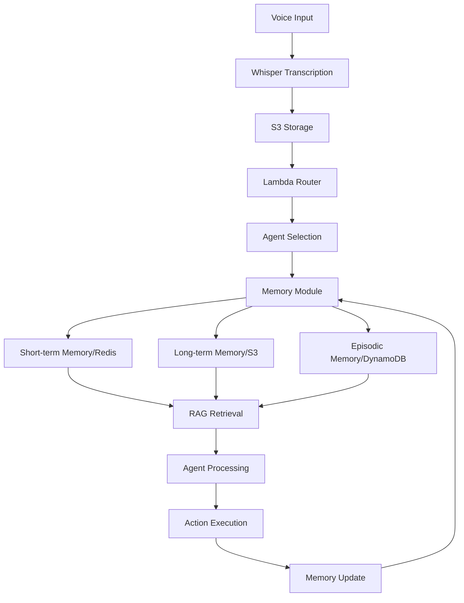

# AI Memory Systems Research: State-of-the-Art and Implementation Recommendations for WhisperSync

## Executive Summary

This research document comprehensively examines current AI memory systems, focusing on implementations in ChatGPT, Claude, and modern LLM architectures. Key findings indicate a shift toward adaptive memory systems that incorporate human-like forgetting mechanisms, distributed architectures for scalability, and sophisticated retrieval methods. For WhisperSync's long-term memory strategy, we recommend implementing a hybrid approach combining prompt caching, adaptive forgetting based on the Ebbinghaus curve, and RAG-enhanced retrieval with cross-attention mechanisms.

## 1. ChatGPT Memory Infrastructure and Recency Heuristics

### Architecture Overview

ChatGPT's memory system operates as a sophisticated prompt injection mechanism with two primary components:

1. **Saved Memories**: Explicitly stored information requested by users
2. **Chat History**: Contextual insights gathered from previous conversations

### Technical Implementation

- **System Prompt Hack**: Memory implemented as dynamic context injection at conversation start
- **GPU Memory Management**: 
  - Uses NVIDIA H100 GPUs with High Bandwidth Memory (HBM)
  - 8 GPUs per node with NVLink interconnect
  - Primary bottleneck: GPU RAM rather than compute resources
  - Cache misses require full conversation recomputation (~1M operations for 1K characters)

### Database Architecture

```
┌─────────────────────┐
│   User Profiles     │
│  (SQL/NoSQL DB)     │
└──────────┬──────────┘
           │
┌──────────▼──────────┐
│   Redis Cache       │
│ (Conversation State)│
└──────────┬──────────┘
           │
┌──────────▼──────────┐
│  Elasticsearch      │
│ (Interaction Logs)  │
└─────────────────────┘
```

### Recency Heuristics

- **Idle Eviction**: Conversations removed from GPU cache after inactivity
- **User Control**: Full memory management in Settings > Personalization > Memory
- **Persistence**: Memories survive conversation deletion
- **Update Frequency**: Continuous summarization during active conversations

### Key Insights for WhisperSync

1. Implement tiered memory storage (hot/warm/cold)
2. Use Redis for active memory state with S3 archival
3. Consider GPU memory constraints when scaling
4. Provide user-facing memory controls

## 2. Anthropic's Theory of Mind and Persistent Memory Efforts

### Theory of Mind Research (2024)

Claude demonstrates sophisticated ToM-like capabilities:

- **Multi-level Recursive Beliefs**: Handles up to 6th-order belief states ("I think that you believe that she knows...")
- **Performance**: Adult-level or superior performance on standard ToM tests
- **Implementation**: Instruction-tuning encourages perspective-taking similar to human social development

### Memory Implementations

#### Prompt Caching (2024)
- Public beta on Claude 3.5 Sonnet and Claude 3 Haiku
- Enables context preservation across conversations
- Reduces token usage and improves response coherence

#### Extended Thinking and Gaming Memory
- Successfully played Pokémon through tens of thousands of interactions
- Memory components:
  - Screen pixel input processing
  - Function call history
  - State persistence beyond context limits

#### Claude Code Memory System
Three-tier memory architecture:
1. **Session Memory**: Current workflow preferences
2. **Project Memory**: Project-specific guidelines
3. **Global Memory**: Cross-project preferences

### Mind Mapping Research

Anthropic's breakthrough in 2024:
- Extracted millions of conceptual features from Claude 3.0 Sonnet
- Enables feature manipulation (amplification/suppression)
- Revealed "faithfulness" problem: models make decisions based on unexpressed factors

### Implications for WhisperSync

1. Implement multi-tier memory similar to Claude Code
2. Consider feature extraction for memory categorization
3. Build in transparency about memory limitations
4. Design for extended interaction sequences

## 3. Personalization Architecture in Current-Gen Assistants

### Agent-Native Architecture Shift (2024)

Modern systems moving from external planning to built-in capabilities:

```
Before: LLM → External Planning → Tools → Response
After:  [LLM with Built-in Planning + Tool Use + Memory] → Response
```

### Core Components

1. **Brain/Coordinator**
   - Decision-making hub
   - Goal definition
   - Tool preference management
   - Persona-based style guidance

2. **Memory Systems**
   - Short-term: Chain-of-thought for single queries
   - Long-term: Weeks/months of interaction history
   - Retrieval: Relevance-based with semantic search

3. **Planning Module**
   - Task decomposition
   - Sub-task prioritization
   - Workflow orchestration

4. **Tool Integration**
   - External API connections
   - Database interfaces
   - Knowledge base access

### Production Architectures

#### ReWOO Architecture (Microsoft)
- Decouples reasoning, working, and observation
- 65% reduction in token usage
- Improved scalability and cost efficiency

#### Microservice Approach
```yaml
services:
  - agent-coordinator
  - memory-service
  - planning-service
  - tool-executor
  - retrieval-service
```

### Personalization Best Practices

1. **Adaptive Memory**: Smart decisions about storage timing and retrieval
2. **Context-Aware Tools**: Tool selection based on user history
3. **Conversational Guidance**: Natural dialogue for preference learning
4. **Multi-Modal Integration**: Handle text, voice, and visual inputs

## 4. Knowledge Decay and Belief Revision Patterns

### Ebbinghaus Forgetting Curve Implementation

MemoryBank (2024) formula:
```python
recency_score = base_score * (0.995 ** hours_elapsed)
```

### Adaptive Forgetting Benefits

1. **Cognitive Load Reduction**: Selective retention of key information
2. **Abstraction Enhancement**: Natural detail pruning for core knowledge
3. **Flexibility**: Dynamic adjustment based on context

### Catastrophic Forgetting Solutions

#### Problem
- Traditional fine-tuning causes knowledge loss
- LoRA fails to prevent forgetting in continual learning

#### Solutions
1. **Functionally Invariant Paths (FIP)**: Retain prior task performance
2. **Memory Banks**: External storage instead of model updates
3. **Retrieval Optimization**: Focus on memory access over retraining

### Memory Structures

Common implementations:
- **Chunks**: Sub-goal based memory units (HiAgent)
- **Knowledge Triples**: Semantic + episodic combination (Arigraph)
- **Atomic Facts**: Granular information storage
- **Summaries**: Compressed interaction histories

### Implementation Recommendations

1. **Decay Function**: Implement exponential decay with tunable parameters
2. **Importance Scoring**: Multi-factor relevance calculation
3. **Selective Forgetting**: Context-based retention policies
4. **Memory Consolidation**: Periodic compression and summarization

## 5. Adaptive Attention/Memory Modeling in RAG and Agent Frameworks

### RAG Architecture Evolution (2024)

#### Core Components
1. **Dense Retrieval**: Vector similarity search
2. **Cross-Attention**: Retrieved document integration
3. **Chunked Processing**: RETRO-style chunk attention

#### Advanced Implementations

**CRAG (Corrective RAG)**
- Handles retrieval failures gracefully
- Fallback mechanisms for missing documents
- Self-correction loops

**Memory-Augmented Transformers**
- Explicit memory banks
- TRIME: Training with memory augmentation
- Persistent context beyond token limits

### Attention Mechanisms

```python
# Simplified cross-attention in RAG
def cross_attention(query, retrieved_docs):
    # Attention over retrieved documents
    attention_weights = softmax(query @ retrieved_docs.T)
    context = attention_weights @ retrieved_docs
    return context
```

### Benchmarking Progress

2024 Benchmarks:
- **RAGBENCH**: 100,000 examples across 5 domains
- **Multihop-RAG**: Multi-step reasoning evaluation
- Focus on retrieval quality and generation coherence

### Future Directions

1. **Agentic AI**: Dynamic orchestration of LLMs and knowledge bases
2. **Autonomous Assistants**: Self-directed task completion
3. **Verifiable Results**: Authoritative source attribution

## 6. Practical Implementation Recommendations for WhisperSync

### Architecture Design



### Memory Implementation Strategy

#### 1. Tiered Memory System
```python
class WhisperSyncMemory:
    def __init__(self):
        self.hot_cache = RedisCache()  # < 24 hours
        self.warm_storage = DynamoDB()  # < 30 days
        self.cold_archive = S3()        # > 30 days
        
    def store(self, key, value, importance):
        # Adaptive storage based on importance
        if importance > 0.8:
            self.hot_cache.set(key, value)
        self.warm_storage.put(key, value)
        
    def retrieve(self, query, context):
        # Multi-tier retrieval with decay
        results = []
        results.extend(self.hot_cache.search(query))
        results.extend(self.warm_storage.query(query))
        return self.apply_decay(results)
```

#### 2. Forgetting Mechanism
```python
def calculate_memory_score(memory_item):
    age_hours = (datetime.now() - memory_item.timestamp).hours
    recency = 0.995 ** age_hours
    importance = memory_item.importance
    access_frequency = memory_item.access_count / age_hours
    
    return (recency * 0.3 + 
            importance * 0.5 + 
            access_frequency * 0.2)
```

#### 3. RAG Integration
```python
class WhisperSyncRAG:
    def __init__(self):
        self.embedder = SentenceTransformer()
        self.vector_store = Pinecone()
        
    def enhance_with_memory(self, transcript, agent_type):
        # Retrieve relevant memories
        query_embedding = self.embedder.encode(transcript)
        memories = self.vector_store.query(
            query_embedding,
            filter={"agent": agent_type},
            top_k=5
        )
        
        # Apply cross-attention
        enhanced_context = self.cross_attention(
            transcript, 
            memories
        )
        return enhanced_context
```

#### 4. Agent-Specific Memory Policies

```yaml
memory_policies:
  work_agent:
    retention_days: 90
    summarization_frequency: weekly
    importance_threshold: 0.6
    
  memory_agent:
    retention_days: unlimited
    summarization_frequency: monthly
    importance_threshold: 0.4
    
  github_agent:
    retention_days: 180
    summarization_frequency: per_project
    importance_threshold: 0.7
```

### Implementation Phases

#### Phase 1: Foundation (Weeks 1-4)
- Implement Redis-based short-term memory
- Basic decay function with configurable parameters
- Simple importance scoring

#### Phase 2: RAG Enhancement (Weeks 5-8)
- Vector embedding for all memories
- Semantic search with Pinecone/Weaviate
- Cross-attention mechanism for context enhancement

#### Phase 3: Adaptive Systems (Weeks 9-12)
- Implement Ebbinghaus curve-based forgetting
- Multi-factor importance scoring
- Agent-specific memory policies

#### Phase 4: Advanced Features (Weeks 13-16)
- Theory of Mind modeling for user intent
- Belief revision system
- Memory consolidation and summarization

### Monitoring and Evaluation

```python
class MemoryMetrics:
    @track_metric
    def retrieval_relevance(self, query, results):
        return cosine_similarity(query, results).mean()
    
    @track_metric
    def memory_utilization(self):
        return {
            "hot_cache_hit_rate": self.hot_hits / self.total_queries,
            "avg_retrieval_time": self.total_time / self.total_queries,
            "memory_decay_rate": self.calculate_decay_stats()
        }
```

### Security and Privacy Considerations

1. **Encryption**: All memories encrypted at rest and in transit
2. **Access Control**: Agent-specific memory isolation
3. **User Control**: Full memory management API
4. **Compliance**: GDPR-compliant deletion mechanisms

### Cost Optimization

1. **Tiered Storage**: Move old memories to cheaper storage
2. **Compression**: Summarize old memories to reduce storage
3. **Selective Caching**: Cache only high-importance memories
4. **Batch Operations**: Group memory operations for efficiency

## Conclusion

The state of AI memory systems in 2024 shows clear trends toward:
- Adaptive, human-like forgetting mechanisms
- Multi-tiered storage architectures
- RAG-enhanced retrieval systems
- Agent-native memory integration

For WhisperSync, implementing a hybrid approach that combines the best practices from ChatGPT's prompt caching, Claude's multi-tier memory, and modern RAG architectures will provide a robust foundation for long-term memory capabilities. The key is balancing retention with adaptability while maintaining user control and system efficiency.

The recommended implementation prioritizes practical, incremental improvements while building toward a sophisticated memory system that can support WhisperSync's vision of a "cognitive exoskeleton" for thought capture and action.