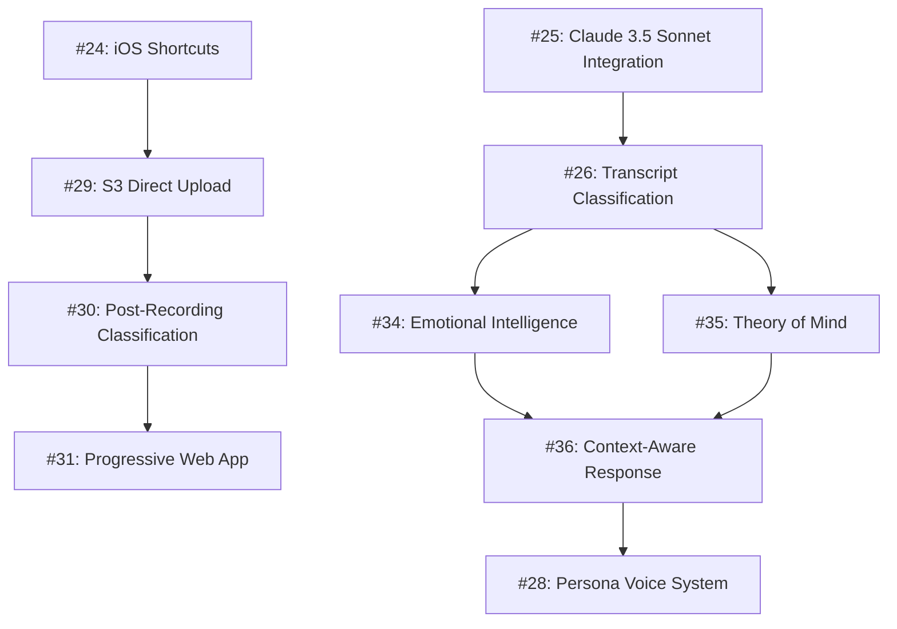
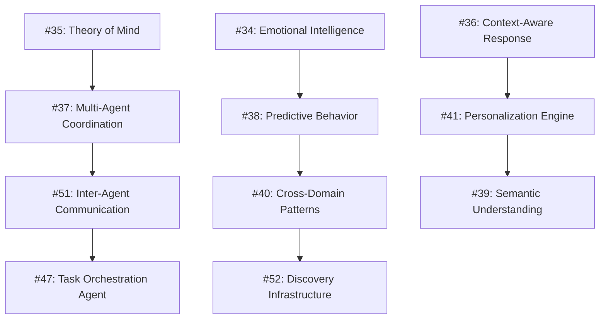
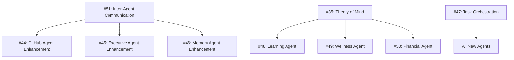
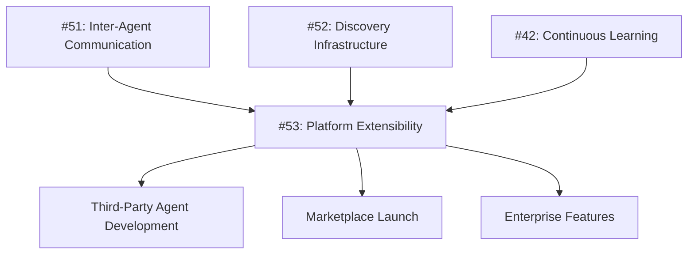

# 🗺️ WhisperSync Dependency Mapping & Implementation Strategy

## Executive Summary

With 30 comprehensive GitHub issues created across 4 major epics, WhisperSync requires careful dependency mapping to ensure optimal implementation sequence. This document provides a strategic roadmap for executing the transformation from voice transcription tool to cognitive exoskeleton platform.

**Total Scope**: 30 GitHub issues across 4 epics  
**Estimated Effort**: 350+ development weeks  
**Implementation Timeline**: 18-24 months with proper resource allocation  
**Critical Success Factor**: Proper dependency sequencing and parallel execution

---

## 🎯 Strategic Implementation Phases

### Phase 1: Foundation (Months 1-6)
**Goal**: Establish core infrastructure and mobile capabilities

#### Critical Path Dependencies

#### Parallel Execution Streams
- **Stream A**: AI Foundation (#25, #26, #34, #35)
- **Stream B**: Mobile Infrastructure (#24, #29, #30, #31)
- **Stream C**: Agent Enhancement Planning (#44, #45, #46)

### Phase 2: Intelligence (Months 7-12)
**Goal**: Implement advanced AI capabilities and agent coordination

#### Critical Path Dependencies

#### Parallel Execution Streams
- **Stream A**: Agent Coordination (#37, #51, #47)
- **Stream B**: Pattern Intelligence (#38, #40, #52)
- **Stream C**: Advanced AI (#39, #41, #42)

### Phase 3: Agent Evolution (Months 13-18)
**Goal**: Transform existing agents and create new specialized agents

#### Critical Path Dependencies

#### Parallel Execution Streams
- **Stream A**: Core Agent Enhancement (#44, #45, #46)
- **Stream B**: Lifestyle Agents (#48, #49, #50)
- **Stream C**: Advanced Features (#32, #33, #43)

### Phase 4: Platform Ecosystem (Months 19-24)
**Goal**: Build extensible platform and developer ecosystem

#### Critical Path Dependencies

---

## 📊 Dependency Matrix

### High-Priority Dependencies (Must Complete First)

| Issue | Blocks | Critical For |
|-------|--------|-------------|
| #25: Claude 3.5 Sonnet | #26, #34, #35, #36 | All AI capabilities |
| #26: Classification | #30, #37, #38, #40 | Intelligent routing |
| #35: Theory of Mind | #37, #38, #41, #47 | Personalization & coordination |
| #51: Inter-Agent Comm | #44, #45, #46, #47 | Agent evolution |
| #24: iOS Shortcuts | #29, #30, #31, #32 | Mobile workflow |

### Medium-Priority Dependencies (Enable Features)

| Issue | Blocks | Enhancement For |
|-------|--------|-----------------|
| #34: Emotional Intelligence | #36, #38, #28 | Context-aware responses |
| #29: S3 Direct Upload | #30, #31, #32 | Mobile independence |
| #37: Multi-Agent Coord | #47, #48, #49, #50 | New agent capabilities |
| #52: Discovery Infrastructure | #40, #41, #42 | Pattern intelligence |

### Low-Priority Dependencies (Optional)

| Issue | Blocks | Nice-to-Have For |
|-------|--------|------------------|
| #33: Apple Watch | None | Ultimate convenience |
| #43: AI Safety | #53 | Enterprise readiness |
| #42: Continuous Learning | #53 | Platform maturity |

---

## 🚀 Parallel Execution Strategy

### Maximum Parallelization Opportunities

#### Week 1-4: Foundation Sprint
**4 Parallel Teams**
- **Team A**: Claude Integration (#25)
- **Team B**: iOS Shortcuts (#24)
- **Team C**: S3 Upload Infrastructure (#29)
- **Team D**: Agent Enhancement Design (#44, #45, #46)

#### Week 5-8: Intelligence Sprint
**3 Parallel Teams**
- **Team A**: Classification Engine (#26)
- **Team B**: Emotional Intelligence (#34)
- **Team C**: Theory of Mind (#35)

#### Week 9-12: Mobile Sprint
**2 Parallel Teams**
- **Team A**: Post-Recording UI (#30)
- **Team B**: Progressive Web App (#31)

### Resource Allocation Recommendations

#### Phase 1 (Months 1-6): 12 Engineers
- **4 AI Engineers**: Claude, Classification, Emotional Intelligence, Theory of Mind
- **3 Mobile Engineers**: iOS, S3, PWA
- **2 Backend Engineers**: Infrastructure, APIs
- **2 Frontend Engineers**: UI/UX, Classification Interface
- **1 DevOps Engineer**: Deployment, monitoring

#### Phase 2 (Months 7-12): 15 Engineers
- **6 AI Engineers**: Advanced AI features, coordination
- **3 Agent Engineers**: Agent enhancement
- **3 Infrastructure Engineers**: Communication, discovery
- **2 Mobile Engineers**: Advanced mobile features
- **1 Platform Engineer**: Extensibility planning

#### Phase 3 (Months 13-18): 18 Engineers
- **5 Agent Engineers**: New agent development
- **4 AI Engineers**: Specialized AI features
- **3 Infrastructure Engineers**: Platform features
- **3 Mobile Engineers**: Watch app, notifications
- **2 Backend Engineers**: Performance, scaling
- **1 Security Engineer**: Safety, compliance

#### Phase 4 (Months 19-24): 20 Engineers
- **6 Platform Engineers**: SDK, marketplace
- **4 Agent Engineers**: Third-party integration
- **4 AI Engineers**: Advanced learning, safety
- **3 Infrastructure Engineers**: Enterprise features
- **3 Quality Engineers**: Testing, validation

---

## ⚠️ Risk Mitigation Strategies

### Technical Risks

#### High-Risk Dependencies
1. **Claude 3.5 Sonnet Integration (#25)**
   - **Risk**: API limits, cost overruns
   - **Mitigation**: Implement caching, fallback models, usage monitoring
   - **Contingency**: Local model deployment option

2. **Inter-Agent Communication (#51)**
   - **Risk**: Complex event choreography
   - **Mitigation**: Start with simple pub/sub, iterate complexity
   - **Contingency**: Direct API calls as fallback

3. **Discovery Infrastructure (#52)**
   - **Risk**: Search performance at scale
   - **Mitigation**: Prototype with small datasets, optimize incrementally
   - **Contingency**: Simplified search with future enhancement

#### Medium-Risk Dependencies
1. **Theory of Mind (#35)**
   - **Risk**: AI model complexity
   - **Mitigation**: Start with rule-based system, add ML incrementally
   - **Contingency**: User preference settings

2. **Multi-Agent Coordination (#37)**
   - **Risk**: Coordination complexity
   - **Mitigation**: Simple task routing first, complex workflows later
   - **Contingency**: Manual agent selection

### Resource Risks

#### Skill Gaps
- **AI/ML Engineers**: Critical for 60% of issues
- **Mobile Engineers**: Essential for user experience
- **Platform Engineers**: Required for extensibility

#### Mitigation Strategies
- **Hire Early**: Recruit specialized talent in Phase 1
- **Cross-Training**: Develop internal capabilities
- **Consulting**: Engage specialists for complex features

---

## 📈 Success Metrics by Phase

### Phase 1 Success Criteria
- [ ] Mobile capture working without Mac dependency
- [ ] Basic AI classification > 90% accuracy
- [ ] Sub-3-second response time
- [ ] 100% of current use cases maintained

### Phase 2 Success Criteria
- [ ] Multi-agent workflows functioning
- [ ] Predictive features showing value
- [ ] User satisfaction > 4.5/5
- [ ] 50% improvement in task completion

### Phase 3 Success Criteria
- [ ] 7 agents operational
- [ ] Cross-agent coordination working
- [ ] 90% user retention
- [ ] 10x use case coverage

### Phase 4 Success Criteria
- [ ] SDK released with documentation
- [ ] 10+ third-party agents
- [ ] Marketplace operational
- [ ] Enterprise-ready platform

---

## 🎯 Implementation Recommendations

### Immediate Actions (Next 30 Days)
1. **Assign Issue Owners**: Each issue needs a technical lead
2. **Create Technical Spikes**: Prototype risky dependencies
3. **Set Up Development Environment**: Prepare for parallel development
4. **Establish Testing Strategy**: Automated testing for all components

### Quick Wins (First 90 Days)
1. **iOS Shortcuts Integration (#24)**: Immediate user value
2. **Claude 3.5 Sonnet Integration (#25)**: Foundation for everything
3. **S3 Direct Upload (#29)**: Remove Mac dependency
4. **Basic Classification (#26)**: Intelligent routing

### Strategic Milestones
- **Month 3**: Mobile independence achieved
- **Month 6**: AI intelligence operational
- **Month 12**: Agent coordination working
- **Month 18**: Full agent ecosystem
- **Month 24**: Platform ecosystem launched

---

## 🔄 Continuous Validation Strategy

### Weekly Reviews
- Dependency validation
- Risk assessment updates
- Resource allocation adjustments
- Timeline refinements

### Monthly Assessments
- Phase completion criteria
- Success metric evaluation
- User feedback integration
- Strategic pivot decisions

### Quarterly Planning
- Resource reallocation
- Priority adjustments
- Timeline updates
- Risk mitigation reviews

---

## 📋 Conclusion

This dependency mapping provides a clear roadmap for transforming WhisperSync from a simple voice transcription tool into a comprehensive cognitive exoskeleton platform. The key to success lies in:

1. **Respecting Dependencies**: Don't start downstream work without upstream completion
2. **Maximizing Parallelization**: Use independent work streams effectively
3. **Managing Risk**: Prototype high-risk dependencies early
4. **Maintaining Quality**: Don't sacrifice quality for speed
5. **Staying Flexible**: Adapt as you learn

With proper execution of this roadmap, WhisperSync will evolve into a transformative platform that truly serves as a cognitive exoskeleton for users, amplifying their capabilities across all life domains.

---

*"The goal is not to build a tool, but to build a companion for the human journey."*