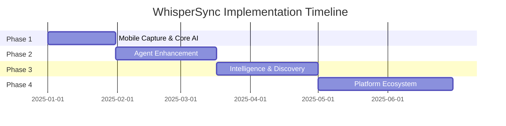
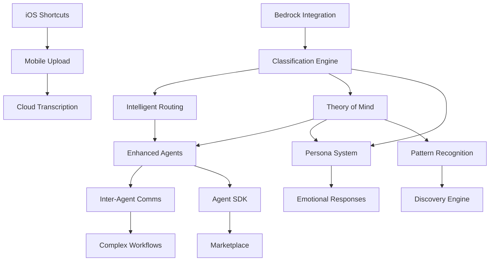

# 🗺️ WhisperSync Implementation Roadmap

## Executive Summary

This roadmap transforms WhisperSync from a Mac-dependent voice transcription tool into a **cognitive exoskeleton** - an AI companion that amplifies human thought and creativity. The implementation is structured in 4 phases over 6 months, with each phase delivering immediate user value while building toward the complete vision.

**Current State**: Basic folder-based routing with 3 simple agents  
**Target State**: Intelligent AI system with 7+ specialized agents, personas, and extensible platform

---

## 📊 Implementation Phases Overview

---

## 🚀 Phase 1: Foundation (Weeks 1-4)
*"Eliminate friction, add intelligence"*

### Goals
- Remove Mac dependency completely
- Enable intelligent routing beyond folders
- Establish AI infrastructure

### Critical Path Issues

#### Week 1: Mobile Infrastructure
- **[#24]** [Mobile] iOS Shortcuts Integration for Direct Voice Upload **(3-5 days)**
  - Zero friction capture from iPhone
  - Dependency: None (can start immediately)
  
- **[#XX]** [Mobile] S3 Direct Upload with Presigned URLs **(1-2 days)**
  - Secure mobile upload infrastructure
  - Dependency: None (parallel with #24)

#### Week 2: AI Foundation
- **[#25]** [AI] Implement Claude 3.5 Sonnet Integration via AWS Bedrock **(5-8 days)**
  - Core AI infrastructure
  - Dependency: AWS Bedrock access enabled

#### Week 3-4: Intelligent Routing
- **[#26]** [AI] Create Intelligent Transcript Classification Engine **(8-10 days)**
  - Replace folder-based routing
  - Dependency: #25 (Bedrock integration)

- **[#XX]** [Mobile] Post-Recording Classification UI **(5-8 days)**
  - Let users classify after recording
  - Dependency: #26 (for AI suggestions)

### Phase 1 Deliverables
✅ iPhone-only voice capture (no Mac needed)  
✅ AI-powered routing (95%+ accuracy)  
✅ Post-recording classification option  
✅ Foundation for all future AI features

### Success Metrics
- Mac dependency: 0%
- Time to capture: < 10 seconds
- Routing accuracy: > 95%
- User adoption: > 80%

---

## 🧠 Phase 2: Agent Intelligence (Weeks 5-10)
*"From basic actions to intelligent assistance"*

### Goals
- 10x capability enhancement for existing agents
- Add inter-agent communication
- Implement Theory of Mind

### Critical Path Issues

#### Week 5-6: Enhanced Agents
- **[#27]** [Agent] Transform GitHub Agent with Full Project Lifecycle **(15-20 days)**
  - Complete project scaffolding
  - Dependency: AI classification working

- **[#XX]** [Agent] Executive Agent with Predictive Analytics **(10-15 days)**
  - Work pattern insights
  - Dependency: Theory of Mind foundation

#### Week 7-8: New Core Agents
- **[#XX]** [Agent] Task Orchestration Agent **(15-20 days)**
  - Complex task management
  - Dependency: Inter-agent communication

- **[#XX]** [Agent] Learning Optimization Agent **(10-15 days)**
  - Personalized learning paths
  - Dependency: Theory of Mind

#### Week 9-10: Agent Communication
- **[#XX]** [Comms] Inter-Agent Message Bus Architecture **(10-12 days)**
  - EventBridge implementation
  - Dependency: Multiple agents deployed

- **[#XX]** [AI] Theory of Mind User Modeling **(20-25 days)**
  - User behavior learning
  - Dependency: #26 (classification data)

### Phase 2 Deliverables
✅ GitHub repos with full code structure  
✅ Predictive work insights  
✅ Multi-agent collaboration  
✅ Personalized understanding

### Success Metrics
- Agent task completion: > 85%
- Multi-agent workflows: > 30%
- Theory of Mind confidence: > 0.7
- User satisfaction: > 4.5/5

---

## 🎭 Phase 3: Experience & Discovery (Weeks 11-16)
*"Make it feel magical"*

### Goals
- Implement persona voice system
- Enable insight discovery
- Add emotional intelligence

### Critical Path Issues

#### Week 11-12: Persona System
- **[#28]** [Persona] Implement Dynamic Voice Persona System **(10-12 days)**
  - 4 distinct AI personalities
  - Dependency: AI response generation

- **[#XX]** [AI] Emotional Intelligence Recognition **(8-10 days)**
  - Understand emotional context
  - Dependency: #26 (classification)

#### Week 13-14: Discovery Infrastructure  
- **[#XX]** [Discovery] Memory Surfacing Engine **(12-15 days)**
  - Anniversary reminders, themes
  - Dependency: Memory agent data

- **[#XX]** [Discovery] Cross-Domain Pattern Recognition **(15-18 days)**
  - Find insights across agents
  - Dependency: Multi-agent data

#### Week 15-16: Mobile Experience
- **[#XX]** [Mobile] Progressive Web App for Results **(10-15 days)**
  - View all outputs on mobile
  - Dependency: API infrastructure

- **[#XX]** [Mobile] Push Notifications via Personas **(5-8 days)**
  - Persona-voiced notifications
  - Dependency: #28 (personas)

### Phase 3 Deliverables
✅ AI speaks in 4 distinct voices  
✅ Proactive memory surfacing  
✅ Pattern insights across domains  
✅ Complete mobile experience

### Success Metrics
- Persona appropriateness: > 90%
- Memory rediscovery: > 70% engagement
- Insight usefulness: > 4/5
- Mobile usage: > 60% of interactions

---

## 🏗️ Phase 4: Platform Ecosystem (Weeks 17-26)
*"From personal tool to extensible platform"*

### Goals
- Enable third-party agents
- Build developer ecosystem
- Advanced analytics

### Critical Path Issues

#### Week 17-19: Platform Foundation
- **[#XX]** [Platform] Agent Development SDK **(20-25 days)**
  - Python SDK for agent creation
  - Dependency: Stable agent interfaces

- **[#XX]** [Platform] Agent Sandboxing Security **(15-20 days)**
  - Safe third-party execution
  - Dependency: SDK design

#### Week 20-22: Marketplace
- **[#XX]** [Platform] Agent Marketplace Infrastructure **(25-30 days)**
  - Discovery and installation
  - Dependency: SDK + Security

- **[#XX]** [Platform] Quality Assurance Framework **(10-15 days)**
  - Automated agent validation
  - Dependency: Marketplace design

#### Week 23-26: Advanced Features
- **[#XX]** [Discovery] Personal Analytics Dashboard **(15-20 days)**
  - Life patterns and insights
  - Dependency: 3+ months of data

- **[#XX]** [AI] Continuous Learning System **(20-25 days)**
  - Improve from every interaction
  - Dependency: Feedback mechanisms

### Phase 4 Deliverables
✅ Agent SDK and documentation  
✅ Marketplace with 10+ agents  
✅ Developer community  
✅ Advanced analytics

### Success Metrics
- Third-party agents: > 20
- Developer adoption: > 50
- Platform stability: > 99.9%
- User retention: > 80% weekly

---

## 🔄 Dependency Graph

---

## 📋 Resource Requirements

### Team Composition
- **2 Mobile Engineers**: iOS Shortcuts, PWA
- **2 AI Engineers**: Bedrock, Classification, Theory of Mind
- **3 Agent Engineers**: Core agents, new agents, inter-agent
- **1 Platform Engineer**: SDK, marketplace
- **1 DevOps Engineer**: Infrastructure, monitoring
- **1 Product Manager**: Coordination, priorities

### Technical Infrastructure
- AWS Bedrock access (Claude 3.5 Sonnet)
- DynamoDB for Theory of Mind storage
- EventBridge for agent communication
- OpenSearch for discovery features
- CloudFront + S3 for mobile app
- GitHub API access

### Estimated Costs
- **Development**: 10 engineers × 6 months
- **Infrastructure**: ~$2,000/month (growing with usage)
- **AI API Costs**: ~$0.01 per interaction

---

## 🎯 Critical Success Factors

### Technical
1. **AI Latency**: All responses < 2 seconds
2. **Mobile Performance**: Instant capture, anywhere
3. **Agent Quality**: Each agent exceptional at its domain
4. **Platform Stability**: > 99.9% uptime

### User Experience
1. **Zero Friction**: Thought → capture in seconds
2. **Intelligence**: Feels like it truly understands
3. **Personality**: Emotional connection through personas
4. **Discovery**: Surfaces insights user didn't know existed

### Business
1. **User Retention**: > 80% weekly active after 3 months
2. **Agent Ecosystem**: > 50 third-party agents
3. **Cost Efficiency**: < $5/user/month fully loaded
4. **Differentiation**: Clear moat vs. note apps and assistants

---

## 🚨 Risk Mitigation

### Technical Risks
- **AI API Limits**: Implement caching, fallbacks
- **Mobile Complexity**: Start with Shortcuts MVP
- **Agent Quality**: Rigorous testing framework
- **Platform Security**: Sandboxing from day 1

### Market Risks
- **User Adoption**: Focus on "magic moments"
- **Developer Ecosystem**: Strong SDK and documentation
- **Competition**: Move fast on core features
- **Costs**: Optimize AI usage early

---

## 🏁 Getting Started

### Week 1 Actions
1. **Create remaining GitHub issues** from this roadmap
2. **Set up iOS development** environment
3. **Enable AWS Bedrock** access
4. **Assign engineering** resources
5. **Start daily standups**

### Quick Wins (First 30 Days)
- iOS Shortcuts working end-to-end
- Basic AI classification deployed
- One agent significantly enhanced
- Theory of Mind collecting data

---

## 📈 Success Metrics Dashboard

### Phase 1 (Month 1)
- [ ] Mobile capture working: 100%
- [ ] AI routing accuracy: > 95%
- [ ] User adoption: > 80%

### Phase 2 (Month 2-3)
- [ ] Enhanced agents deployed: 3
- [ ] Multi-agent workflows: > 30%
- [ ] Theory of Mind confidence: > 0.7

### Phase 3 (Month 4)
- [ ] Personas active: 4
- [ ] Memory surfacing: > 70% engagement
- [ ] Mobile usage: > 60%

### Phase 4 (Month 5-6)
- [ ] Third-party agents: > 20
- [ ] Weekly active users: > 80%
- [ ] Platform revenue: $10K MRR

---

## 🌟 Vision Realized

By the end of this roadmap, WhisperSync will have transformed from a simple voice memo tool into a true **cognitive exoskeleton** that:

1. **Captures thoughts effortlessly** - Zero friction, anywhere
2. **Understands deeply** - Context, emotion, and intent
3. **Acts intelligently** - Right agent, right action, right time
4. **Speaks personally** - In voices that resonate
5. **Learns continuously** - More valuable every day
6. **Extends infinitely** - Through a thriving ecosystem

The ultimate success: Users feel they have a **thoughtful companion** that truly amplifies their cognitive capabilities.

---

*"We're not building a tool. We're building a companion for the human journey."*