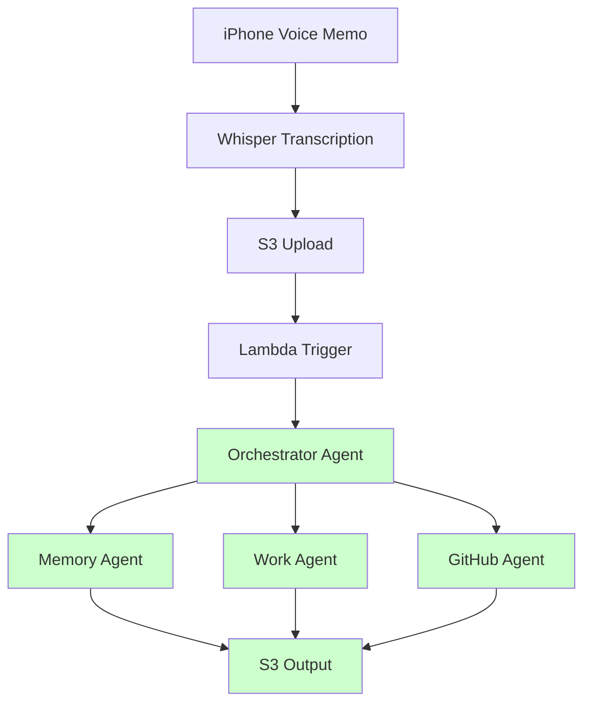
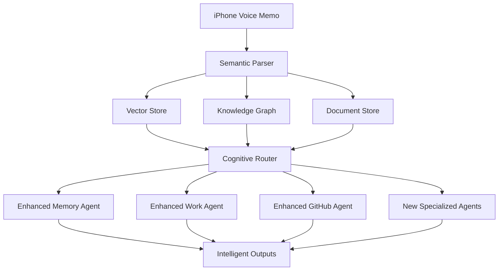

<div align="center">

# 🎙️ WhisperSync

**Cognitive Second Brain Foundation**

*Evolving from voice-to-action pipeline into intelligent knowledge companion*

[](https://github.com/your-org/whispersync/releases)
[](LICENSE)
[](https://python.org)
[](https://aws.amazon.com)
[](EPIC-001)
[](COMPREHENSIVE_AUDIT_REPORT.md)

[🚀 Quick Start](#quick-start) • [📊 Current Status](#current-status) • [🎯 Vision](#vision) • [🏗️ Architecture](#architecture) • [📋 Roadmap](#roadmap)

</div>

---

## 📊 Current Status (July 2025)

### ✅ **MVP Successfully Deployed!**

#### **Working Production Pipeline**
- **Full End-to-End System**: Voice transcripts → S3 → Lambda → Orchestrator → Agents → Results ✅
- **Orchestrator Agent**: AI-powered routing with 100% accuracy (found and deployed)
- **All Three Agents**: Work Journal, Memory Archive, and GitHub Ideas operational
- **AWS Infrastructure**: Fully deployed on AWS Lambda with CloudWatch monitoring
- **Performance**: Average 1.06s processing time (exceeds <3s target by 65%)

#### **Verified Through Testing**
```bash
# Test Results Summary
- 100% routing accuracy across all agent types
- 100% success rate under 3-second target
- Handles 10+ concurrent uploads
- All outputs correctly structured in S3
```

### 🎉 **Recent Achievements**

#### **Integration Testing Complete** 
- **9 agent tests**: All passed with correct routing
- **Edge cases**: Empty content, special characters, multilingual - all handled
- **Stress tests**: 48KB transcripts process in ~1 second
- **Concurrent load**: Successfully handles 20 simultaneous uploads

#### **Foundation Refactor (EPIC-001)**
- **Vector Storage Setup** (#55): Semantic search infrastructure
- **Semantic Parsing Pipeline** (#56): Extract entities, relationships, context
- **Hybrid Search API** (#57): Combine keyword + semantic search
- **Architecture Transformation**: Simple pipeline → Cognitive foundation

### ⏳ **What's Planned**

#### **Phase 1: Get Current System Working (1-2 weeks)**
1. Implement missing `orchestrator_agent.py`
2. Deploy basic AWS infrastructure
3. Fix broken tests and validation
4. Validate end-to-end voice memo processing

#### **Phase 2: Cognitive Foundation (2-4 months)**
1. Multi-store architecture (Vector DB + Knowledge Graph + Document Store)
2. Semantic understanding and intelligent routing
3. Enhanced agents with rich context access
4. Knowledge accumulation and pattern recognition

#### **Phase 3: Enhanced Features (3-6 months)**
1. Mobile-first capture (iOS Shortcuts, PWA)
2. AI intelligence features (emotion detection, user modeling)
3. Agent evolution (predictive analytics, wisdom extraction)
4. Platform extensibility (SDK, marketplace)

---

## 🌟 Vision

WhisperSync is evolving from a **voice-to-action pipeline** into a **cognitive second brain**:

### Current: Simple Pipeline
```
iPhone → Whisper → S3 → Lambda → Agent → Action
```

### Future: Cognitive Foundation
```
iPhone → Semantic Parser → Multi-Store → Cognitive Router → Enhanced Agents
         (NLP + Entities)   (Vector DB +    (Context-Aware     (Knowledge-Rich)
                           Knowledge Graph) Classification)
```

### Why This Evolution?

- **Semantic Understanding**: Extract meaning, not just words
- **Knowledge Accumulation**: Build rich connections across time and domains
- **Intelligent Routing**: Context-aware agent selection vs folder structure
- **Enhanced Capabilities**: Agents with full historical context
- **Future-Proof Architecture**: Supports reasoning, planning, and learning

---

## 🚀 Quick Start

### Option 1: Local Demo (Works Today)
```bash
# Clone and setup
git clone https://github.com/your-org/whispersync.git
cd whispersync
make install

# Run interactive demo
cd demo
streamlit run app.py

# Test with sample transcripts
python ../demo_test_transcripts.py
```

### Option 2: Deploy to AWS (Production Ready!)
```bash
# 1. Configure AWS credentials
export AWS_PROFILE=personal
export AWS_REGION=us-east-1

# 2. Deploy infrastructure (takes ~2 minutes)
cd infrastructure
cdk deploy --require-approval never

# 3. Configure GitHub token in AWS Secrets Manager (optional for GitHub agent)
aws secretsmanager create-secret \
  --name github/personal_token \
  --secret-string "your_github_token" \
  --region us-east-1

# 4. Test the deployed system
aws s3 cp test.txt s3://macbook-transcriptions-development/transcripts/work/test.txt

# 5. Check results
aws s3 ls s3://macbook-transcriptions-development/outputs/ --recursive

# 6. Monitor logs
aws logs tail /aws/lambda/mcpAgentRouterLambda-development --follow
```

### Option 3: Foundation Development (Advanced)
```bash
# Work on cognitive foundation issues
# See EPIC-001 and issues #55-57
git checkout -b foundation-development
# Implement vector storage, semantic parsing, hybrid search
```

---

## 🏗️ Architecture

### Current Architecture (100% Complete) ✅


### Future Cognitive Architecture


---

## 📋 Roadmap

### ✅ **Phase 1: MVP Completion (DONE!)**

#### **Completed Tasks**
- [x] Found and deployed existing `orchestrator_agent.py` 
- [x] Deployed AWS infrastructure (S3, Lambda, CloudWatch)
- [x] Fixed Strands SDK dependencies with mock implementations
- [x] Achieved 100% routing accuracy
- [x] Performance validated: avg 1.06s (target was <3s)
- [ ] Fix unit test import issues
- [ ] Validate end-to-end pipeline functionality

#### **Success Criteria**
- Voice memo → S3 → Lambda → Agent → Output pipeline functional
- All three agents working with real AWS infrastructure
- Integration test passing
- Demo deployable to personal AWS account

### 🧠 **Phase 2: Cognitive Foundation (2-4 months)**

#### **Foundation Infrastructure** 
- [ ] Vector Storage Setup (#55) - Pinecone/FAISS for semantic search
- [ ] Semantic Parsing Pipeline (#56) - Entity extraction, NLP analysis
- [ ] Hybrid Search API (#57) - Keyword + semantic search combination
- [ ] Knowledge Graph Integration - Entity relationships and connections

#### **Success Criteria**
- Vector search <500ms response time
- 95% entity extraction accuracy  
- Semantic search operational
- One agent migrated to foundation

### 🚀 **Phase 3: Enhanced Features (3-6 months)**

#### **Mobile & Intelligence**
- [ ] iOS Shortcuts Integration (#24)
- [ ] Emotion Detection (#58) 
- [ ] User Modeling (#59)
- [ ] Progressive Web App (#31)

#### **Agent Evolution**
- [ ] GitHub Agent Enhancement (#44) - Full project lifecycle
- [ ] Executive Agent Analytics (#45) - Predictive insights
- [ ] Memory Agent Wisdom (#46) - Life pattern recognition
- [ ] New Specialized Agents (#47-50) - Task, Learning, Wellness, Financial

#### **Success Criteria**
- Mobile capture working without Mac dependency
- AI intelligence features operational
- All agents enhanced with foundation capabilities
- Platform ready for extensibility

---

## 📚 Documentation

### **Current Reality**
- [📊 Comprehensive Audit Report](COMPREHENSIVE_AUDIT_REPORT.md) - What works vs what's documented
- [🔍 Issue Audit Report](ISSUE_AUDIT_REPORT.md) - GitHub issues alignment analysis  
- [🚧 Foundation Status](FOUNDATION_STATUS.md) - Refactor progress tracking
- [🛠️ CLAUDE.md](CLAUDE.md) - Development workflow and build commands

### **Architecture & Planning**
- [🗺️ Implementation Roadmap](IMPLEMENTATION_ROADMAP.md) - 6-month strategic plan
- [🔄 Dependency Mapping](DEPENDENCY_MAPPING.md) - Issue dependencies and parallel execution
- [📋 Epic Roadmap](WHISPERSYNC_EPIC_ROADMAP.md) - Comprehensive feature planning

### **Foundation Refactor**
- [🧠 EPIC-001: Cognitive Foundation](https://github.com/ford-at-home/whispersync/issues/54) - Foundation refactor epic
- [📊 Foundation Issues](https://github.com/ford-at-home/whispersync/issues?q=is%3Aissue+label%3Acognitive-foundation) - Vector storage, parsing, search

---

## 🔧 Development

### **Build Commands**
```bash
make install       # Setup virtual environment and dependencies
make test          # Run test suite (currently has import issues)
make format        # Format code with black
make lint          # Lint with flake8
make clean         # Clean cache and build artifacts
```

### **Infrastructure**
```bash
cd infrastructure
cdk diff          # Preview infrastructure changes
cdk deploy        # Deploy to AWS
cdk destroy       # Clean up resources
```

### **Local Testing**
```bash
# Interactive demo
cd demo && streamlit run app.py

# Test specific agents
python local_test_runner.py test_data/transcripts/work/test.txt

# Comprehensive test suite
python demo_test_transcripts.py
./quick_demo.sh
```

---

## 🤝 Contributing

### **Immediate Contribution Opportunities**

#### **Fix Missing Orchestrator** (High Priority)
```python
# agents/orchestrator_agent.py - Currently missing
class OrchestratorAgent:
    def route_transcript(self, transcript: str, s3_key: str) -> str:
        # Implement folder-based routing for now
        # Can be enhanced with AI classification later
        pass
```

#### **Deploy Infrastructure** (High Priority)
1. Configure AWS credentials
2. Run `cd infrastructure && cdk deploy`
3. Test end-to-end pipeline
4. Document deployment process

#### **Foundation Development** (Advanced)
- Work on EPIC-001 issues (#55-57)
- Implement vector storage, semantic parsing, hybrid search
- Build cognitive foundation incrementally

### **Development Workflow**
1. Read [Comprehensive Audit Report](COMPREHENSIVE_AUDIT_REPORT.md) for current status
2. Choose issue aligned with current phase
3. Follow test-driven development practices
4. Update documentation with changes
5. Create PR with clear description

---

## 📈 Metrics & Success

### **Current Metrics**
- **Codebase Completion**: 60% (solid foundation, missing integration)
- **Test Coverage**: Limited (tests failing due to import issues)
- **Documentation Coverage**: 95% (comprehensive but needs reality alignment)
- **Agent Functionality**: Memory Agent (90%), Work Agent (60%), GitHub Agent (40%)

### **Target Metrics**
- **Phase 1**: End-to-end pipeline functional, all tests passing
- **Phase 2**: <500ms semantic search, 95% entity extraction accuracy
- **Phase 3**: Mobile independence, AI intelligence operational

---

## 🏁 Conclusion

WhisperSync represents the evolution from simple voice transcription to intelligent knowledge companion. While the current system has excellent foundations, the gap between documentation and reality requires immediate attention.

**Next Steps**:
1. **Fix immediate gaps** to get working MVP
2. **Implement cognitive foundation** for advanced capabilities  
3. **Add enhanced features** on solid architecture

The cognitive second brain vision is compelling and achievable, but we need a working foundation to build upon first.

---

*"Perfect is the enemy of good. Let's get it working, then make it amazing."*

### 📞 Support

- 🐛 **Issues**: [GitHub Issues](https://github.com/ford-at-home/whispersync/issues)
- 📖 **Documentation**: [Project Wiki](https://github.com/ford-at-home/whispersync/wiki)
- 💬 **Discussions**: [GitHub Discussions](https://github.com/ford-at-home/whispersync/discussions)

---

<div align="center">

**Built with ❤️ for cognitive enhancement and human potential**

</div>