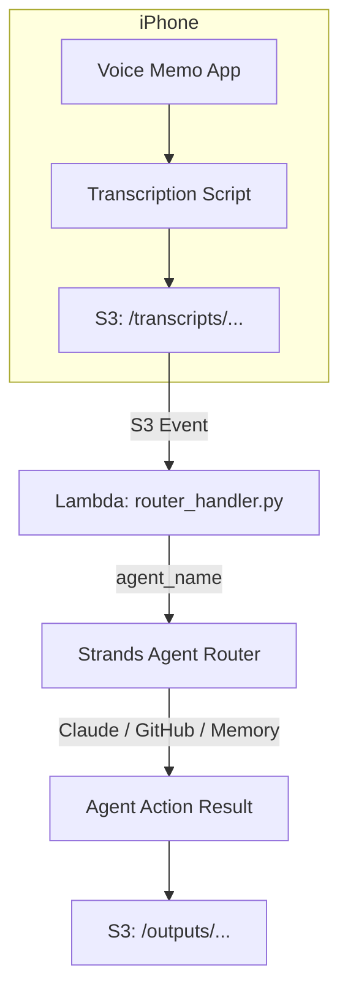

# 🧠 Voice Memo MCP Agent System (AWS + Strands Edition)

This project turns iPhone voice memos into intelligent workflows, automatically routed to different agents based on folder/prefix and powered by AWS Strands.

---

## 📦 Overview

### Use Case
You record voice memos into folders like `work`, `memories`, or `github_ideas` on your iPhone. These are transcribed (locally or remotely), synced to S3, and processed via AWS Strands agents triggered by S3 events.

### WHY THIS ARCHITECTURE EXISTS

**Voice-First Philosophy**: Most insights happen away from keyboards - while walking, driving, or in the shower. Voice capture removes friction from thought-to-action pipelines.

**Folder-Based Routing**: Users already think in categories ("this is work stuff" vs "this is personal"). Folder names become intent signals without requiring complex NLP.

**S3 Event-Driven**: Decouples capture from processing. Voice memos sync when connectivity allows, processing happens asynchronously in the cloud.

**Specialized Agents**: Single-purpose agents are more maintainable than one complex agent trying to handle everything. Each can evolve independently.

---

## 📁 Architecture

### WHY S3 AS THE BACKBONE

**Durability**: Voice memos contain irreplaceable thoughts. S3's 99.999999999% durability protects against data loss.

**Event-Driven Triggers**: S3 events provide reliable, automatic processing without polling or scheduling complexity.

**Cost-Effective Storage**: Most transcripts are small text files. S3's pay-per-use model scales from zero to millions of memos.

**Universal Access**: Any system (iPhone, Android, desktop) can write to S3, making the pipeline device-agnostic.

### 📤 Input
- Transcriptions are synced into:
  ```
  s3://<YOUR_BUCKET>/transcripts/{agent_name}/{timestamp}.txt
  ```

**Example:**
```
s3://voice-mcp/transcripts/work/2025-06-09_1030.txt
```

### ⚙️ Trigger

#### WHY LAMBDA FOR ROUTING

**Serverless Scaling**: Handles burst traffic (like uploading a day's worth of memos) without pre-provisioned servers.

**Cost Efficiency**: Only pay for actual processing time, not idle server capacity.

**Automatic Retries**: Built-in error handling and retry logic for transient failures.

**Simple Logic**: Route determination is straightforward - extract folder name from S3 key path.

- S3 `ObjectCreated` event on prefix `transcripts/`
- Triggers a Lambda that:
  1. Extracts the agent name from the key
  2. Fetches the transcript
  3. Passes content + context to a registered Strands agent

---

## 🤖 Supported Agents

### WHY THESE THREE AGENTS

**Work Journal Agent**: Knowledge workers need to track progress and reflect on achievements. Voice memos capture context that written logs miss.

**Memory Agent**: Personal memories fade unless preserved. AI can extract emotional themes and connections humans might miss in the moment.

**GitHub Agent**: Great ideas die in note-taking apps. Immediate repo creation with AI-generated structure reduces the activation energy for side projects.

### 1. `work` → 🧾 Work Journal Agent
- Appends entries to a weekly work log in S3
- Generates weekly summaries
- Suggests reflection or feedback actions using Claude

**WHY WEEKLY LOGS**: Daily logs create noise; monthly logs lose detail. Weekly strikes the balance for reflection and review cycles.

### 2. `memories` → 🧠 Memory Agent
- Stores memory narratives in `memories/` as `.jsonl`
- Optionally classifies sentiment, theme, and key figures
- Claude can clean up or stylize the memory

**WHY JSONL FORMAT**: Each memory is self-contained but part of a larger narrative. JSONL allows efficient streaming and partial processing.

### 3. `github_ideas` → 🐙 GitHub Agent
- Creates new repos based on ideas
- Uses Claude to generate:
  - Repo name
  - README
  - Initial issue list
- Calls GitHub API (via `PyGithub`)
- Stores metadata in `s3://voice-mcp/github/history.jsonl`

**WHY AUTO-CREATE REPOS**: Friction kills creativity. By the time you manually create a repo, format a README, and add issues, the initial enthusiasm has faded.

---

## 🧬 AWS Architecture

### WHY THIS SPECIFIC AWS STACK

**Lambda + S3**: Serverless architecture scales to zero when unused, infinite when needed.

**Strands Integration**: Purpose-built for AI agent orchestration, handles Claude integration complexity.

**Secrets Manager**: GitHub tokens require secure storage and rotation. Environment variables in Lambda are insufficient.

**EventBridge (Future)**: Native scheduling for weekly summaries without external cron jobs.



---

## 🛠️ Setup

### WHY CDK OVER TERRAFORM

**Python Consistency**: Same language as the agents reduces context switching.

**AWS Native**: CDK generates CloudFormation, ensuring compatibility with all AWS features.

**Type Safety**: Compile-time checks prevent common infrastructure mistakes.

### 1. Deploy Infrastructure (CDK or Terraform)
- Create an S3 bucket: `voice-mcp`
- Enable `ObjectCreated:*` events on prefix `transcripts/`
- Create a Lambda: `mcpAgentRouterLambda`
- Grant Lambda permissions:
  - `s3:GetObject`
  - `bedrock:InvokeModel`
  - `secretsmanager:GetSecretValue` (for GitHub token)

### 2. Strands Agent Registration

#### WHY SEPARATE REGISTRATION STEP

**Decoupled Deployment**: Infrastructure and agent logic can be updated independently.

**Environment Isolation**: Same agent code can be registered in dev/staging/prod with different configurations.

**Versioning**: Strands handles agent versioning and rollback scenarios.

Register agents in Strands using your CLI or Python SDK:

```python
# Note: The Strands SDK provides two import paths:
# - 'strands_sdk' for agent registration and invocation
# - 'strands' for the Agent class and decorators
from strands_sdk import register_agent

register_agent(
    name="work_journal_agent",
    description="Summarizes and logs weekly work activity.",
    entrypoint="agents/work_journal.py"
)

register_agent(
    name="memory_agent",
    description="Cleans and archives personal memories.",
    entrypoint="agents/memory_agent.py"
)

register_agent(
    name="github_idea_agent",
    description="Turns voice ideas into GitHub repos.",
    entrypoint="agents/github_idea.py"
)
```

### 3. Store GitHub Token

#### WHY SECRETS MANAGER OVER ENVIRONMENT VARIABLES

**Rotation Support**: Secrets Manager can automatically rotate tokens on schedule.

**Audit Trail**: Track who accessed secrets and when.

**Cross-Service Access**: Multiple Lambda functions can share the same secret securely.

**Encryption at Rest**: Secrets are encrypted with AWS KMS by default.

In AWS Secrets Manager:

```
Name: github/personal_token
Value: <YOUR_TOKEN>
```

---

## 🐍 Lambda Logic (router_handler.py)

```python
import boto3, os
from strands_sdk import invoke_agent  # For invoking registered agents

s3 = boto3.client('s3')

def lambda_handler(event, context):
    bucket = event['Records'][0]['s3']['bucket']['name']
    key    = event['Records'][0]['s3']['object']['key']
    
    agent_name = key.split("/")[1]
    obj = s3.get_object(Bucket=bucket, Key=key)
    transcript = obj['Body'].read().decode()

    result = invoke_agent(
        name=f"{agent_name}_agent",
        input={"transcript": transcript, "s3_key": key}
    )
    
    output_key = key.replace("transcripts", "outputs").replace(".txt", "_response.json")
    s3.put_object(
        Bucket=bucket,
        Key=output_key,
        Body=result.encode("utf-8")
    )
```

---

## 🧪 Test Locally

### WHY LOCAL TESTING MATTERS

**Fast Iteration**: No deploy cycle means rapid agent development.

**Cost Control**: Avoid AWS charges during development and debugging.

**Offline Development**: Work without internet connectivity.

**Deterministic Testing**: Control inputs and timing for reproducible tests.

Place transcript in `test_data/transcripts/work/2025-06-09_1230.txt`

Run:

```bash
python local_test_runner.py transcripts/work/2025-06-09_1230.txt
```

This mimics the Lambda + S3 pipeline and prints the result.

---

## 📓 Logs & Output
Processed agent responses go to:

```bash
s3://<YOUR_BUCKET>/outputs/{agent}/{date}_response.json
```

Agent history (optional) written to:

```bash
s3://<YOUR_BUCKET>/{agent}/history.jsonl
```

---

## 📅 Future Extensions

### WHY THESE SPECIFIC EXTENSIONS

**Weekly Summaries**: Automated reflection reduces cognitive load while maintaining the benefits of journaling.

**Vector Embeddings**: Semantic search across memories enables "show me times I felt grateful" queries that keyword search can't handle.

**Additional Agents**: Life has more domains than work/memory/code. Family updates, dream journals, and spiritual reflections follow the same pattern.

**Claude Chaining**: Complex workflows ("create a repo AND add it to my work log") require agent coordination beyond simple routing.

- Schedule weekly summary via EventBridge + Step Functions
- Store vector embeddings in Pinecone or OpenSearch for memories
- Add family, dreams, or spiritual agents
- Use Claude for suggestion chaining or emotional tone analysis

---

## 🧼 Requirements

| Dependency | Version |
|------------|---------|
| Python | 3.11+ |
| boto3 | latest |
| strands | latest |
| strands-tools | latest |
| PyGithub | latest |
| AWS Lambda runtime | python3.11 |

---

## 🧠 Philosophy

### WHY "COGNITIVE EXOSKELETON"

This system is not a productivity hack.

It's a cognitive exoskeleton — built to support memory, reflection, and effortless ideation through natural speech and structured automation.

**Beyond Productivity**: Most productivity tools optimize efficiency. This system optimizes for insight preservation and creative flow.

**Natural Interface**: Speech is humanity's primary communication medium. Text-first tools force translation of thoughts into a foreign format.

**Automation with Intent**: Not all automation improves life. This system automates the tedious parts (formatting, storage, organization) while preserving the human parts (insight, emotion, creativity).

**Memory as Infrastructure**: Human memory is unreliable. External memory systems should be effortless to use and intelligent in organization.

**Friction is the Enemy**: Every click, every form field, every menu is an opportunity for a thought to be lost forever.

---

## 📫 Contact

For help, ideas, or weird bugs, open an issue or whisper into the nearest tree.

### WHY "WHISPER INTO THE NEAREST TREE"

This system celebrates the ephemeral nature of thoughts and the magic of voice capture. Ideas often come in quiet moments in nature, away from screens and keyboards. The tree reference reminds us that the best insights emerge when we're connected to something larger than our devices.
