<div align="center">

# 🎙️ WhisperSync

**Voice-to-Action AI Platform**

*Transform your voice memos into intelligent actions with AI-powered agent routing*

[](https://github.com/your-org/whispersync/releases)
[](LICENSE)
[](https://python.org)
[](https://aws.amazon.com)
[](tests/)
[](tests/)

[🚀 Quick Start](#quick-start) • [📖 Documentation](#documentation) • [🎯 Features](#features) • [🏗️ Architecture](#architecture) • [🤝 Contributing](#contributing)

</div>

---

## 🌟 Overview

WhisperSync v2 transforms voice memos into intelligent actions through specialized agents and personalized AI voices:

- 💡 **Ideas** → GitHubAgent creates full repositories with code
- 🎯 **Tactical thoughts** → ExecutiveAgent tracks patterns and productivity
- 💭 **Personal memories** → SpiritualAgent preserves with emotional depth
- 🎭 **4 AI Personas** → British Guardian, Indian Mystic, Southern Sage, The Challenger

> *"A cognitive exoskeleton that learns your patterns and speaks in voices that resonate with your soul."*

---

## 🎯 Features

### ✨ Core Capabilities

| Feature | Description | Component |
|---------|-------------|----------|
| 🧠 **Theory of Mind** | Evolving understanding of your patterns, preferences, and growth | ExecutiveAgent |
| 📖 **Diary System** | Rich metadata extraction with verbatim preservation | SpiritualAgent |
| 🚀 **Smart Projects** | Full code generation with technology detection | GitHubAgent |
| 🎭 **Voice Personas** | 4 distinct AI voices for different contexts | Persona Layer |
| 📊 **Knowledge Evolution** | Categories and insights that grow organically | All Agents |
| 🔍 **Pattern Discovery** | Cross-agent insights and behavioral analysis | Knowledge Architecture |

### 🎨 What Makes WhisperSync v2 Special

- **🧠 Evolving Intelligence**: Theory of Mind that learns your unique patterns
- **🎭 Personalized Voices**: 4 distinct personas that match your context
- **📦 Smart Classification**: Ideas vs Tactical vs Personal routing
- **🌱 Organic Growth**: Knowledge categories emerge from usage
- **💭 Emotional Depth**: Preserves not just words but feelings
- **🔮 Predictive Insights**: Discovers patterns you didn't know existed

## 📦 Voice Memo Classification

Every voice memo is intelligently classified into one of three buckets:

### 1. 💡 **Ideas** → GitHubAgent
- Project concepts and app ideas
- Technical solutions and innovations  
- Creative projects and experiments
- **Output**: Full GitHub repository with code structure

### 2. 🎯 **Tactical** → ExecutiveAgent
- Work reflections and productivity insights
- Decision-making and strategy thoughts
- Time management and boundary setting
- **Output**: Theory of Mind updates, categorized insights

### 3. 💭 **Personal** → SpiritualAgent (Diary)
- Memories and emotional experiences
- Family moments and relationships
- Personal growth and reflections
- **Output**: Preserved with metadata, no immediate actions

## 🏗️ Architecture

**AI-First Classification**: Every transcript is analyzed by Claude to determine its bucket, replacing folder-based routing with intelligent understanding.

**Theory of Mind**: The system maintains and evolves a sophisticated model of who you are, what you value, and how you work.

**Persona Intelligence**: Four distinct AI voices respond based on context, emotion, and time of day - each with its own personality and purpose.

**Knowledge Evolution**: Categories and relationships emerge organically from your usage patterns rather than being predefined.

---

### 🌐 System Overview

```mermaid
graph TD
    A[📱 iPhone Voice Memo] --> B[🎤 Local Whisper]
    B --> C[☁️ S3 Upload]
    C --> D{🧠 AI Classifier}
    
    D -->|💡 Idea| E[GitHubAgent]
    D -->|🎯 Tactical| F[ExecutiveAgent]
    D -->|💭 Personal| G[SpiritualAgent]
    
    E --> H[📦 Full Repository]
    F --> I[🧠 Theory of Mind]
    G --> J[📖 Diary Archive]
    
    I --> K{🎭 Persona Selection}
    J --> K
    
    K --> L[🇬🇧 Guardian]
    K --> M[🧘 Mystic]
    K --> N[🤠 Sage]
    K --> O[😈 Challenger]
```



### 🚀 Technology Stack

| Layer | Technology | Purpose |
|-------|------------|----------|
| **Frontend** | Streamlit, iPhone Voice Memos | User interface and voice capture |
| **Processing** | AWS Lambda, Python 3.11 | Serverless compute and routing |
| **AI/ML** | Claude 3.5 Sonnet (Bedrock) | Natural language understanding |
| **Storage** | Amazon S3, JSONL | Durable transcript and output storage |
| **Security** | AWS IAM, Secrets Manager | Authentication and credential management |
| **Monitoring** | CloudWatch, X-Ray | Observability and performance tracking |
| **Infrastructure** | AWS CDK, TypeScript | Infrastructure as code |

### 💡 Design Philosophy

**Durability**: Voice memos contain irreplaceable thoughts. S3's 99.999999999% durability protects against data loss.

**Event-Driven Triggers**: S3 events provide reliable, automatic processing without polling or scheduling complexity.

**Cost-Effective Storage**: Most transcripts are small text files. S3's pay-per-use model scales from zero to millions of memos.

**Universal Access**: Any system (iPhone, Android, desktop) can write to S3, making the pipeline device-agnostic.

### 📤 Data Flow

#### Input Structure
```
s3://voice-mcp/
├── transcripts/
│   ├── work/2024/01/15/20240115_143022.txt
│   ├── memories/2024/01/15/20240115_143155.txt
│   └── github_ideas/2024/01/15/20240115_143301.txt
├── outputs/
│   ├── work/2024/01/15/response_20240115_143025.json
│   ├── memory/2024/01/15/response_20240115_143158.json
│   └── github/2024/01/15/response_20240115_143304.json
└── analytics/
    └── daily_metrics/2024-01-15.json
```

#### Processing Pipeline

1. **📱 Capture**: Record voice memo on iPhone
2. **🎤 Transcribe**: Local Whisper converts speech to text
3. **☁️ Upload**: Transcript uploaded to S3 with metadata
4. **🧠 Route**: Orchestrator analyzes content and selects agent(s)
5. **🤖 Process**: Specialized agent(s) perform actions
6. **💾 Store**: Results stored with comprehensive metadata
7. **📊 Monitor**: Metrics and analytics updated

### ⚙️ Agent Orchestration

#### Intelligent Routing Engine

**Serverless Scaling**: Handles burst traffic (like uploading a day's worth of memos) without pre-provisioned servers.

**Cost Efficiency**: Only pay for actual processing time, not idle server capacity.

**Automatic Retries**: Built-in error handling and retry logic for transient failures.

**Simple Logic**: Route determination is straightforward - extract folder name from S3 key path.

The orchestrator uses advanced AI to determine optimal routing:

```python
# Routing Decision Process
1. Content Analysis → Extract themes, sentiment, entities
2. Agent Scoring → Calculate relevance for each agent type
3. Confidence Assessment → Determine routing confidence
4. Multi-Agent Detection → Identify complex, mixed-content transcripts
5. Execution Planning → Coordinate parallel or sequential processing
```

#### Routing Accuracy
- **95%+ accuracy** for single-agent routing
- **88%+ accuracy** for multi-agent coordination
- **Sub-500ms** routing decision time
- **Fallback mechanisms** for edge cases

---

## 🤖 AI Agent Ecosystem

### 🎯 Three Core Agents

**GitHubAgent (Ideas)**: Transforms project ideas into fully-structured repositories with code, documentation, and implementation roadmaps. Learns from successful projects to improve suggestions.

**ExecutiveAgent (Tactical)**: Maintains an evolving Theory of Mind about your work patterns, productivity cycles, and decision-making style. Categories emerge and strengthen based on usage.

**SpiritualAgent (Personal)**: Preserves memories with emotional intelligence, extracting people, places, themes, and significance while maintaining verbatim records for authentic recall.

### 🎭 Four Persona Voices

**🇬🇧 The British Guardian**: Chipper BBC-style presenter for morning/evening summaries and confirmations. *"Brilliant work today! You've made splendid progress on three key initiatives..."*

**🧘 The Indian Mystic**: Gentle philosopher for emotional reflections and diary responses. *"Like leaves dancing in the monsoon wind, today's memories reveal the impermanence of joy..."*

**🤠 The Southern Sage**: Wise storyteller for value-based guidance and life lessons. *"Now hold on there, partner. Remember what your granddaddy used to say about rushing..."*

**😈 The Challenger**: Sarcastic truth-teller who calls out contradictions and excuses. *"Oh, another 'urgent' task? Funny how everything's urgent except that book you've been 'writing' for two years..."*

### 🏢 Work Journal Agent

**Purpose**: Transform work-related thoughts into structured professional documentation

**Capabilities**:
- 📝 **Intelligent Categorization**: Automatically sorts activities (coding, meetings, planning)
- 🔍 **Key Point Extraction**: Identifies accomplishments, blockers, and action items
- 📊 **Weekly Summaries**: AI-generated insights and productivity patterns
- 💡 **Smart Recommendations**: Suggests improvements and next steps
- 📈 **Trend Analysis**: Tracks productivity patterns and goal progress

**Output Example**:
```markdown
## 2024-01-15 14:30 UTC

**Categories:** Development, Bug Fixing  
**Sentiment:** Positive - Progress being made

### Key Points
- Fixed authentication system login flow
- Completed API documentation updates
- Identified performance optimization opportunities

### Action Items
- Schedule code review for tomorrow
- Write unit tests for new auth features
```

### 💭 Memory Agent

**Purpose**: Preserve personal experiences with rich emotional and contextual metadata

**Capabilities**:
- 🎭 **Emotional Analysis**: Detects sentiment, mood, and emotional themes
- 🏷️ **Smart Tagging**: Extracts people, places, time periods, and themes
- 🔍 **Semantic Search**: Find memories by concept, not just keywords
- 📚 **Narrative Building**: Connects related memories across time
- 🎨 **Context Preservation**: Maintains the original voice and emotion

**Output Example**:
```json
{
  "timestamp": "2024-01-15T14:30:00Z",
  "summary": "Childhood camping memory with family",
  "themes": ["Family", "Nature", "Wonder", "Childhood"],
  "sentiment": "Positive & Nostalgic",
  "people": ["Family", "Dad"],
  "location": "Camping/Outdoors",
  "time_period": "Childhood (3-12)",
  "emotional_tags": ["Joy", "Peace", "Wonder"]
}
```

### 💡 GitHub Agent

**Purpose**: Transform project ideas into fully-structured GitHub repositories

**Capabilities**:
- 🏗️ **Repository Creation**: Generates optimized repo name and structure
- 📖 **README Generation**: Creates comprehensive project documentation
- 🎯 **Issue Planning**: Breaks down ideas into actionable development tasks
- 🏷️ **Smart Labeling**: Applies relevant topics and technologies
- 📊 **Project Roadmaps**: Creates development milestones and timelines
- 🔗 **Integration Setup**: Configures CI/CD, license, and contribution guidelines

**Output Example**:
```json
{
  "repo_name": "ai-finance-tracker",
  "repo_url": "https://github.com/user/ai-finance-tracker",
  "description": "Personal finance tracker with AI-powered expense categorization",
  "tech_stack": ["Python", "React", "Machine Learning", "Banking APIs"],
  "initial_issues": [
    "Research banking API integration options",
    "Design ML model for expense categorization",
    "Create responsive web interface mockups"
  ],
  "estimated_timeline": "3-4 months",
  "difficulty": "Intermediate"
}
```

---

## 🏗️ AWS Infrastructure

### 🎯 Production Architecture

**Lambda + S3**: Serverless architecture scales to zero when unused, infinite when needed.

**Strands Integration**: Purpose-built for AI agent orchestration, handles Claude integration complexity.

**Secrets Manager**: GitHub tokens require secure storage and rotation. Environment variables in Lambda are insufficient.

**EventBridge (Future)**: Native scheduling for weekly summaries without external cron jobs.


---

## 🚀 Quick Start

### Prerequisites

**Python Consistency**: Same language as the agents reduces context switching.

**AWS Native**: CDK generates CloudFormation, ensuring compatibility with all AWS features.

**Type Safety**: Compile-time checks prevent common infrastructure mistakes.

**System Requirements:**
- Python 3.11+
- Node.js 18+
- AWS CLI configured
- GitHub Personal Access Token

### 🐳 One-Command Setup

```bash
# Clone and deploy in under 5 minutes
git clone https://github.com/your-org/whispersync.git
cd whispersync
./setup.sh --environment development
```

### 📋 Manual Setup

#### 1. Environment Setup
```bash
# Create Python environment
python3.11 -m venv .venv
source .venv/bin/activate
pip install -r requirements-lock.txt

# Install CDK dependencies
cd infrastructure && npm install
```

#### 2. AWS Configuration
```bash
# Configure AWS credentials
aws configure

# Bootstrap CDK (first time only)
cdk bootstrap

# Store GitHub token
aws secretsmanager create-secret \
    --name "github/personal_token" \
    --secret-string "your_github_token_here"
```

#### 3. Deploy Infrastructure
```bash
# Deploy development environment
cd infrastructure
cdk deploy --parameters Environment=development

# Verify deployment
aws lambda list-functions --query 'Functions[?contains(FunctionName, `whispersync`)]'
```

#### 4. Test Your Setup
```bash
# Run demo interface
cd demo
streamlit run app.py

# Or test with sample transcript
python scripts/local_test_runner.py test_data/transcripts/work/test.txt
```

### 🧪 Testing & Validation

```bash
# Run full test suite
make test

# Run specific test categories
make test-unit          # Unit tests only
make test-integration   # Integration tests
make test-local        # Local pipeline test

# Check code quality
make lint              # Code linting
make format            # Code formatting
make coverage          # Test coverage report
```

**Decoupled Deployment**: Infrastructure and agent logic can be updated independently.

**Environment Isolation**: Same agent code can be registered in dev/staging/prod with different configurations.

**Versioning**: Strands handles agent versioning and rollback scenarios.

## 📖 Documentation

| Document | Description |
|----------|-------------|
| [🚀 DEPLOYMENT.md](DEPLOYMENT.md) | Complete deployment guide from dev to production |
| [📡 API.md](API.md) | Comprehensive API reference and examples |
| [🧪 Testing Guide](tests/README.md) | Testing strategies and quality assurance |
| [🔧 Configuration](agents/config.py) | Environment and system configuration |
| [📊 Monitoring](infrastructure/observability.py) | Observability and monitoring setup |

### 🎮 Interactive Demo

Experience WhisperSync without any setup:

```bash
# Launch interactive demo
cd demo && streamlit run app.py
```

**Demo Features:**
- 🎙️ Voice recording simulation
- 🧠 Real-time agent routing
- 📊 Agent comparison interface
- 📈 System monitoring dashboard

### 🎯 Usage Examples

#### Work Journal Entry

**Rotation Support**: Secrets Manager can automatically rotate tokens on schedule.

**Audit Trail**: Track who accessed secrets and when.

**Cross-Service Access**: Multiple Lambda functions can share the same secret securely.

**Encryption at Rest**: Secrets are encrypted with AWS KMS by default.

```python
# Process work-related voice memo
from agents.orchestrator_agent import route_to_agent

result = route_to_agent(
    transcript="I completed the authentication system today. "
             "Fixed three bugs and updated the API docs.",
    source_key="transcripts/work/20240115_143022.txt"
)

print(f"Logged to: {result['processing_results']['work']['log_key']}")
print(f"Summary: {result['processing_results']['work']['summary']}")
```

#### Memory Preservation
```python
# Preserve personal memory with emotional context
result = route_to_agent(
    transcript="I remember my first camping trip with dad. "
             "We sat by the fire and he told me stories about the stars."
)

memory = result['processing_results']['memory']
print(f"Themes: {memory['themes']}")
print(f"Sentiment: {memory['sentiment']}")
print(f"Emotional tags: {memory['emotional_tags']}")
```

#### Project Creation
```python
# Turn idea into GitHub repository
result = route_to_agent(
    transcript="I want to build a habit tracking app that uses "
             "gamification to help people build better routines."
)

project = result['processing_results']['github']
print(f"Repository: {project['repo_url']}")
print(f"Technologies: {project['tech_stack']}")
print(f"Initial issues: {len(project['initial_issues'])}")
```

---

## 🔧 Configuration

### Environment Variables

```bash
# Core Configuration
export WHISPERSYNC_ENV=development    # Environment: development, staging, production
export AWS_REGION=us-east-1           # AWS region for deployment
export BUCKET_NAME=voice-mcp-dev      # S3 bucket for transcripts
export LOG_LEVEL=INFO                 # Logging level

# AI Configuration
export BEDROCK_MODEL=anthropic.claude-3-5-sonnet-20241022-v2:0
export MAX_TOKENS=2000
export MIN_ROUTING_CONFIDENCE=0.6

# Security Configuration
export ENABLE_S3_ENCRYPTION=true
export REQUIRE_TLS=true
export GITHUB_SECRET_NAME=github/personal_token

# Monitoring Configuration
export ENABLE_XRAY=true
export ENABLE_METRICS=true
export METRICS_NAMESPACE=WhisperSync
```

### Advanced Configuration

```python
# Custom configuration for specific environments
from agents.config import WhisperSyncConfig

# Production configuration
config = WhisperSyncConfig.from_environment("production")
print(f"Environment: {config.environment.value}")
print(f"Security enabled: {config.security.require_tls}")
print(f"Monitoring: {config.monitoring.enable_xray}")

# Validate configuration
errors = config.validate()
if errors:
    print(f"Configuration errors: {errors}")
else:
    print("Configuration is valid")
```

## 📊 Performance & Monitoring

### 📈 Key Metrics

| Metric | Development | Production |
|--------|-------------|------------|
| **Processing Time** | < 3 seconds | < 2 seconds |
| **Routing Accuracy** | > 90% | > 95% |
| **Uptime** | 99.0% | 99.9% |
| **Error Rate** | < 5% | < 1% |
| **Cost per Request** | $0.002 | $0.001 |

### 🎯 Monitoring Dashboard

```bash
# View real-time metrics
aws cloudwatch get-dashboard --dashboard-name "WhisperSync-Production"

# Check system health
aws lambda invoke \
    --function-name whispersync-health-check-production \
    --payload '{}' health.json && cat health.json
```

### 🚨 Alerting

- **Error Rate Alerts**: Triggered when error rate > 5%
- **Latency Alerts**: Triggered when processing time > 10 seconds  
- **Cost Alerts**: Daily cost monitoring with thresholds
- **Capacity Alerts**: Lambda concurrency and memory monitoring

---

## 🧪 Testing Strategy

### 🎯 Multi-Layer Testing

**Fast Iteration**: No deploy cycle means rapid agent development.

**Cost Control**: Avoid AWS charges during development and debugging.

**Offline Development**: Work without internet connectivity.

**Deterministic Testing**: Control inputs and timing for reproducible tests.

```bash
# Unit Tests - Fast, isolated component testing
pytest tests/unit/ -v --cov=agents --cov-report=html

# Integration Tests - End-to-end pipeline validation  
pytest tests/integration/ -v --slow

# Voice Quality Tests - Transcription accuracy validation
pytest tests/voice/ -v --audio-samples

# Performance Tests - Load and stress testing
pytest tests/performance/ -v --benchmark

# Security Tests - Vulnerability and compliance testing
pytest tests/security/ -v --security-scan
```

### 🎙️ Voice-Specific Testing

```bash
# Test with different audio conditions
python scripts/test_voice_quality.py \
    --audio-samples tests/voice_samples/ \
    --conditions "clear,noisy,accented" \
    --report voice_quality_report.html
```

### 🔄 Continuous Integration

```yaml
# .github/workflows/test.yml
name: WhisperSync CI/CD
on: [push, pull_request]

jobs:
  test:
    runs-on: ubuntu-latest
    steps:
      - uses: actions/checkout@v3
      - name: Run Test Suite
        run: |
          make install
          make test
          make security-scan
          make performance-benchmark
```

---

## 💾 Data Management

### 📁 Storage Organization

```
s3://voice-mcp-production/
├── transcripts/           # Input voice transcripts
│   ├── work/2024/01/15/   # Work-related transcripts
│   ├── memories/2024/01/15/ # Personal memories
│   └── github_ideas/2024/01/15/ # Project ideas
├── outputs/               # Processed results
│   ├── work/2024/01/15/   # Work journal entries
│   ├── memory/2024/01/15/ # Preserved memories
│   └── github/2024/01/15/ # Created repositories
├── analytics/             # Usage analytics and metrics
│   ├── daily/2024-01-15.json
│   ├── weekly/2024-W03.json
│   └── monthly/2024-01.json
└── backups/              # Automated backups
    └── cross-region/     # Cross-region replication
```

### 🔄 Data Lifecycle

| Data Type | Retention | Archive | Backup |
|-----------|-----------|---------|--------|
| **Transcripts** | 1 year | Glacier after 90 days | Real-time |
| **Outputs** | 2 years | Glacier after 180 days | Daily |
| **Analytics** | 5 years | Deep Archive after 1 year | Weekly |
| **Logs** | 30 days | CloudWatch retention | None |

---

## 🚀 Roadmap

### 🎯 Upcoming Features (Q1 2024)

**Weekly Summaries**: Automated reflection reduces cognitive load while maintaining the benefits of journaling.

**Vector Embeddings**: Semantic search across memories enables "show me times I felt grateful" queries that keyword search can't handle.

**Additional Agents**: Life has more domains than work/memory/code. Family updates, dream journals, and spiritual reflections follow the same pattern.

**Claude Chaining**: Complex workflows ("create a repo AND add it to my work log") require agent coordination beyond simple routing.

- [ ] **🎙️ Native Mobile App** - iOS app with Siri integration
- [ ] **🔍 Advanced Search** - Vector embeddings for semantic memory search
- [ ] **🤝 Team Collaboration** - Shared workspaces and agent coordination
- [ ] **📊 Advanced Analytics** - Productivity insights and trend analysis
- [ ] **🌐 Multi-Language** - Support for 10+ languages with local models
- [ ] **🔗 Integrations** - Slack, Notion, Jira, and 20+ other tools

### 🌟 Long-Term Vision (2024-2025)

- [ ] **🧠 Personalized AI** - Custom agents trained on your patterns
- [ ] **🎨 Multimodal Input** - Image, video, and document processing
- [ ] **🤖 Agent Marketplace** - Community-contributed specialized agents
- [ ] **🌍 Edge Computing** - On-device processing for privacy
- [ ] **🔮 Predictive Insights** - AI-powered suggestions and automation
- [ ] **🎭 Emotional Intelligence** - Advanced mood and wellness tracking

### 💡 Community Contributions

We welcome contributions! Popular community requests:
- 🏥 **Health & Wellness Agent** - Symptom tracking and health insights
- 📚 **Learning Agent** - Study notes and knowledge management
- 💰 **Finance Agent** - Expense tracking and budget insights
- 🏠 **Home Assistant Agent** - Smart home automation and tasks
- 🎵 **Creative Agent** - Music, art, and creative project management

---

## 🔧 Technical Specifications

### 📋 System Requirements

| Component | Minimum | Recommended |
|-----------|---------|-------------|
| **Python** | 3.11+ | 3.11+ |
| **Memory** | 256 MB | 512 MB |
| **Storage** | 1 GB | 10 GB |
| **Network** | 1 Mbps | 10 Mbps |
| **AWS Region** | Any | us-east-1 |

### 📦 Dependencies

```toml
# pyproject.toml
[project]
name = "whispersync"
version = "1.0.0"
requires-python = ">=3.11"

dependencies = [
    "boto3>=1.34.0",
    "anthropic>=0.8.0",
    "PyGithub>=1.59.0",
    "streamlit>=1.29.0",
    "opentelemetry-api>=1.21.0",
    "pydantic>=2.5.0",
]

[project.optional-dependencies]
development = [
    "pytest>=7.4.0",
    "pytest-cov>=4.1.0",
    "black>=23.9.0",
    "flake8>=6.1.0",
    "mypy>=1.6.0",
]
```

---

## 🤝 Contributing

### 🎯 How to Contribute

1. **🍴 Fork the Repository**
   ```bash
   git clone https://github.com/your-username/whispersync.git
   cd whispersync
   ```

2. **🌿 Create Feature Branch**
   ```bash
   git checkout -b feature/amazing-new-agent
   ```

3. **🔧 Make Your Changes**
   - Follow the existing code style and patterns
   - Add comprehensive tests for new functionality
   - Update documentation as needed

4. **✅ Test Your Changes**
   ```bash
   make test
   make lint
   make security-scan
   ```

5. **📝 Submit Pull Request**
   - Clear description of changes
   - Link to related issues
   - Include screenshots/demos if applicable

### 🎨 Code Style

```bash
# Format code
black agents/ tests/

# Lint code  
flake8 agents/ tests/

# Type checking
mypy agents/

# Security scan
bandit -r agents/
```

### 🧪 Testing Guidelines

- **Unit Tests**: Test individual components in isolation
- **Integration Tests**: Test component interactions
- **Voice Tests**: Test with actual audio samples
- **Performance Tests**: Validate latency and throughput
- **Security Tests**: Check for vulnerabilities

### 🏷️ New Agent Development

Creating a new specialized agent:

```python
# agents/your_agent.py
from .base import BaseAgent, Agent, tool
from .utils import TextAnalyzer, ValidationUtils

class YourAgent(BaseAgent):
    def __init__(self, bucket: str = None, correlation_id: str = None):
        super().__init__(bucket=bucket, correlation_id=correlation_id)
        
        if Agent:
            self.agent = Agent(
                system_prompt="Your agent's specialized instructions...",
                tools=[self.your_main_tool],
                model=self.config.aws.bedrock_model
            )
    
    @tool
    def your_main_tool(self, transcript: str) -> Dict[str, Any]:
        """Your agent's main processing function."""
        # Implement your agent logic here
        pass
```

---

## 🌟 Community & Support

### 💬 Get Help

- **📖 Documentation**: Comprehensive guides and API reference
- **🐛 GitHub Issues**: Bug reports and feature requests
- **💡 Discussions**: Community Q&A and ideas
- **📧 Email**: Direct support for enterprise users

### 🏆 Recognition

**Contributors:**
- 🎖️ **Core Maintainers**: [@username1](https://github.com/username1), [@username2](https://github.com/username2)
- 🌟 **Top Contributors**: [@username3](https://github.com/username3), [@username4](https://github.com/username4)
- 🔧 **Infrastructure**: AWS, Anthropic, GitHub

**Special Thanks:**
- OpenAI Whisper team for excellent transcription
- Anthropic for Claude 3.5 Sonnet
- AWS for serverless infrastructure
- Python community for amazing libraries

### 📈 Project Stats


## 🔮 Philosophy & Vision

### 🧠 The Cognitive Exoskeleton

> *"WhisperSync is not just a productivity tool — it's a cognitive exoskeleton that amplifies human thought and creativity."*

We believe that the future of human-computer interaction is:

- **🎙️ Voice-First**: Speech is humanity's most natural interface
- **🤖 AI-Augmented**: Intelligent automation that preserves human creativity
- **🧠 Memory-Enhanced**: External memory that's effortless and intelligent
- **⚡ Friction-Free**: Every barrier removed between thought and action
- **🔒 Privacy-Conscious**: Your thoughts remain yours, enhanced not exploited

### 🎯 Core Principles

1. **🎨 Creativity Over Efficiency**
   - Tools should amplify creativity, not just optimize tasks
   - Preserve the emotional and contextual richness of human thought
   - Enable serendipitous connections and insights

2. **🗣️ Natural Communication**
   - Voice is our most expressive and efficient communication medium
   - No forced translation into rigid text formats
   - Preserve tone, emotion, and spontaneity

3. **🤖 Intelligent Automation**
   - Automate tedious organization and formatting
   - Preserve human creativity and decision-making
   - Learn from patterns without being prescriptive

4. **🧠 Augmented Memory**
   - External memory should be effortless and intelligent
   - Connect related thoughts across time and context
   - Surface insights that might otherwise be lost

5. **⚡ Zero Friction**
   - Every interface element is an opportunity for thought loss
   - Minimize steps between insight and action
   - Make complex operations feel simple and natural

### 🌍 Impact & Vision

WhisperSync represents a fundamental shift toward:
- **🧬 Augmented Intelligence**: Humans and AI working in perfect harmony
- **🌊 Flow States**: Removing barriers to creative expression
- **🎭 Emotional Computing**: Technology that understands and preserves human emotion
- **🌟 Democratic AI**: Advanced AI capabilities accessible to everyone
- **🔮 Future Interfaces**: The beginning of truly natural human-computer interaction

---

---

<div align="center">

## 🌳 "Whisper into the Nearest Tree"

*This system celebrates the ephemeral nature of thoughts and the magic of voice capture.*

*Ideas often come in quiet moments in nature, away from screens and keyboards.*

*The tree reference reminds us that the best insights emerge when we're connected to something larger than our devices.*

---

### 📄 License

**MIT License** - Use WhisperSync freely in your projects

### 🙏 Acknowledgments

Built with love by developers who believe technology should amplify human creativity, not replace it.

**Made with** 🎙️ **Voice** • 🧠 **AI** • ❤️ **Love**

[⭐ Star us on GitHub](https://github.com/your-org/whispersync) • [🐛 Report Issues](https://github.com/your-org/whispersync/issues) • [💡 Request Features](https://github.com/your-org/whispersync/discussions)

</div>
