# 🎙️ WhisperSync v2

**Voice-to-Action AI Platform with Persona Intelligence**

*Transform your voice into intelligent actions through specialized agents and personalized AI voices*

---

## 🌟 Overview

WhisperSync v2 evolves beyond simple transcription into a true "cognitive exoskeleton" that:

- **Classifies** every voice memo into three meaningful buckets
- **Routes** to specialized agents with distinct capabilities  
- **Learns** your patterns through evolving Theory of Mind
- **Responds** through four distinct persona voices
- **Grows** its knowledge architecture organically over time

## 📦 Voice Memo Buckets

Every transcript is intelligently classified into one of three categories:

### 1. 💡 **Idea** → GitHubAgent
- Triggers repository creation with scaffolded code
- Generates complete project structure
- Creates GitHub issues for implementation
- Stored as "cool new idea" for portfolio tracking

### 2. 🎯 **Tactical** → ExecutiveAgent  
- Reflections on productivity, decision-making, strategy
- Updates personal Theory of Mind layer
- Categorizes into granular tags (work.product, workflow.time, personal.boundaries)
- Knowledge architecture evolves over time
- Powers daily summaries and productivity insights

### 3. 💭 **Personal** → SpiritualAgent (Diary)
- Memories, family moments, personal feelings
- Verbatim transcript preservation
- Rich metadata: tags, people, sentiment, significance
- No immediate actions - corpus for future reflections
- Beautiful S3 organization for life reviews

## 🎭 Persona Output Layer

Four distinct ElevenLabs voices deliver personalized responses:

### 1. 🇬🇧 **The British Guardian**
- **Voice**: Chipper, informative, BBC-style
- **When**: Morning + evening summaries, task confirmations
- **Example**: "Brilliant morning! You've got three exciting projects in flight..."

### 2. 🧘 **The Indian Mystic**  
- **Voice**: Gentle, poetic, contemplative
- **When**: After emotionally significant events or diary-rich days
- **Example**: "Like ripples on a still pond, today's memories reveal deeper truths..."

### 3. 🤠 **The Southern Sage**
- **Voice**: Gravelly, grounded, wise
- **When**: Value-based nudges before tough conversations
- **Example**: "Now hold on there, partner. Remember what your daddy used to say..."

### 4. 😈 **The Challenger** (Optional)
- **Voice**: Sarcastic, combative, truth-telling
- **When**: Flags contradictions, calls out stagnation
- **Example**: "Oh, another 'revolutionary' todo app? How's the last five working out?"

## 🏗️ Enhanced Architecture

```mermaid
graph TD
    A[📱 Voice Memo] --> B[🎤 Whisper Transcription]
    B --> C[🧠 AI Classification]
    
    C --> D{📦 Bucket Router}
    
    D -->|Idea| E[💡 GitHubAgent]
    D -->|Tactical| F[🎯 ExecutiveAgent]
    D -->|Personal| G[💭 SpiritualAgent]
    
    E --> H[📂 GitHub Repo]
    F --> I[📊 Theory of Mind]
    G --> J[📖 Diary Archive]
    
    I --> K{🎭 Persona Selection}
    J --> K
    
    K --> L[🇬🇧 Guardian]
    K --> M[🧘 Mystic]
    K --> N[🤠 Sage]
    K --> O[😈 Challenger]
    
    L --> P[🔊 ElevenLabs]
    M --> P
    N --> P
    O --> P
    
    P --> Q[📱 Voice Response]
```



## 🧠 Theory of Mind Evolution

The system maintains a sophisticated understanding of you that evolves over time:

```json
{
  "core_identity": {
    "values": ["innovation", "family", "growth"],
    "work_style": "deep_focus_mornings",
    "communication_preferences": "direct_authentic"
  },
  "behavioral_patterns": {
    "productivity_cycles": "peaks_at_10am",
    "stress_indicators": ["short_responses", "task_switching"],
    "decision_making": "data_driven_with_intuition"
  },
  "knowledge_graph": {
    "work.product.features": 0.85,
    "workflow.time.boundaries": 0.72,
    "personal.health.sleep": 0.68
  }
}
```

## 📚 Diary Feature Specification

Personal memories are stored with rich metadata while preserving verbatim content:

```json
{
  "date": "2025-07-03",
  "tags": ["family", "Rio", "joy", "morning_ritual"],
  "people": ["Rio", "spouse"],
  "locations": ["home", "kitchen"],
  "sentiment": {
    "primary": "joy",
    "secondary": ["gratitude", "love"],
    "intensity": 0.85
  },
  "summary": "Sweet morning moment with Rio at breakfast",
  "verbatim": "Rio said the funniest thing today at breakfast...",
  "quotes": ["'Daddy, why do pancakes look like the sun?'"],
  "significance": 8,
  "growth_indicator": "presence_in_small_moments",
  "audio_url": "s3://voice-memos/2025-07-03T0812.mp3"
}
```

## 🔧 Key Features

### Intelligent Classification
- AI-powered bucket routing with 95%+ accuracy
- Multi-label support for complex thoughts
- Confidence scoring with review queue

### Knowledge Evolution
- Categories emerge from usage patterns
- Relationships strengthen over time
- Cross-agent insight discovery

### Privacy & Control
- All processing happens in your AWS account
- Granular control over persona interactions
- Theory of Mind corrections and rollback

### Voice Intelligence
- Context-aware persona selection
- Emotional state recognition
- Time-of-day optimization

## 🚀 Getting Started

### Prerequisites
- Python 3.11+
- AWS Account with CDK configured
- GitHub Personal Access Token
- ElevenLabs API Key

### Quick Deploy

```bash
# Clone repository
git clone https://github.com/your-org/whispersync-v2.git
cd whispersync-v2

# Install dependencies
pip install -r requirements-lock.txt

# Configure secrets
aws secretsmanager create-secret --name "github/personal_token" --secret-string "ghp_..."
aws secretsmanager create-secret --name "elevenlabs/api_key" --secret-string "xi_..."

# Deploy infrastructure
cd infrastructure
cdk deploy WhisperSyncV2 --all

# Test the system
python scripts/test_voice_memo.py "I have an idea for a mood tracking app"
```

## 📊 System Components

### Core Agents
- **GitHubAgent**: Repository creation, project scaffolding
- **ExecutiveAgent**: Work insights, Theory of Mind, productivity
- **SpiritualAgent**: Memory preservation, emotional intelligence

### Infrastructure
- **S3**: Voice memo storage with intelligent tiering
- **Lambda**: Serverless agent execution
- **SQS**: Decoupled message processing
- **DynamoDB**: Theory of Mind persistence
- **Bedrock**: Claude 3.5 Sonnet integration

### Voice Layer
- **ElevenLabs**: High-quality voice synthesis
- **Persona Engine**: Context-aware voice selection
- **SSML Support**: Natural speech patterns

## 🎯 Use Cases

### Morning Routine
1. Record thoughts while making coffee
2. British Guardian summarizes overnight ideas
3. Executive priorities appear in your calendar

### Work Reflection
1. Voice memo after important meeting
2. ExecutiveAgent extracts insights
3. Theory of Mind updates your patterns
4. Challenger calls out if you're avoiding decisions

### Family Memory
1. Capture moment with loved ones
2. SpiritualAgent preserves with emotional context
3. Indian Mystic reflects on life patterns monthly

### Weekend Project
1. Describe your app idea while walking
2. GitHubAgent creates full repository
3. British Guardian confirms with enthusiasm
4. Code structure ready when you sit down

## 🔮 Roadmap

### Phase 1: Foundation (Current)
- ✅ Three-agent architecture
- ✅ Basic Theory of Mind
- ✅ Persona voice system
- ✅ Diary feature

### Phase 2: Intelligence (Q1 2024)
- [ ] Knowledge graph visualization
- [ ] Cross-agent insight discovery
- [ ] Adaptive category evolution
- [ ] Voice emotion detection

### Phase 3: Integration (Q2 2024)
- [ ] Mobile app with widgets
- [ ] Calendar integration
- [ ] Slack/Teams connectors
- [ ] Family sharing features

### Phase 4: Advanced AI (Q3 2024)
- [ ] Predictive insights
- [ ] Dream analysis agent
- [ ] Health pattern recognition
- [ ] Creative collaboration mode

## 🤝 Contributing

We welcome contributions! See [CONTRIBUTING.md](CONTRIBUTING.md) for guidelines.

Popular requests:
- Additional persona voices
- New agent types
- Integration plugins
- Language support

## 📄 License

MIT License - see [LICENSE](LICENSE) for details.

## 🙏 Acknowledgments

Built with love by engineers who believe technology should amplify human consciousness, not replace it.

---

**Made with** 🎙️ **Voice** • 🧠 **AI** • ❤️ **Love** • 🎭 **Personality**