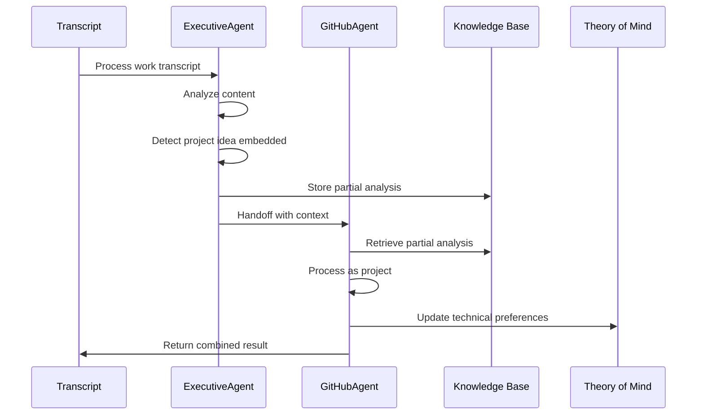
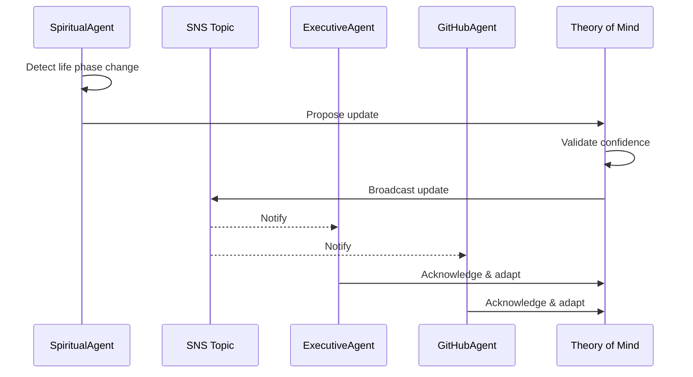
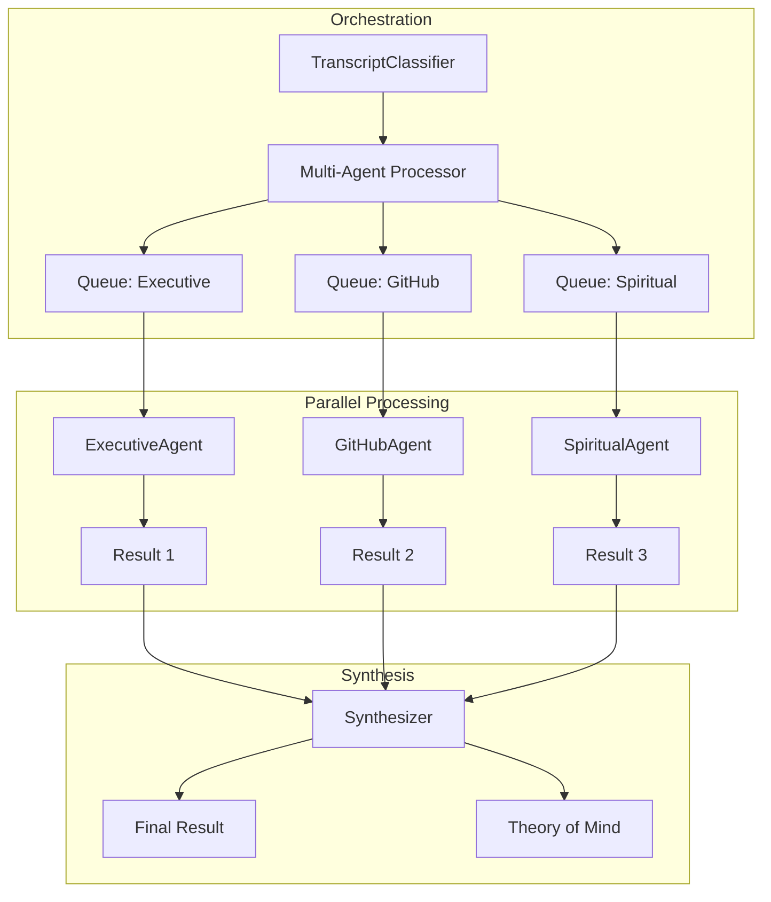
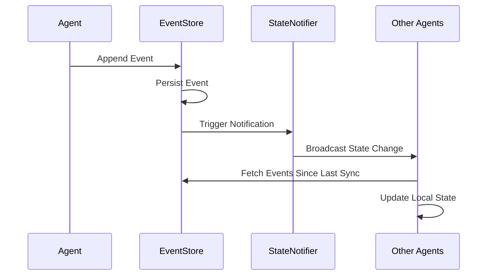
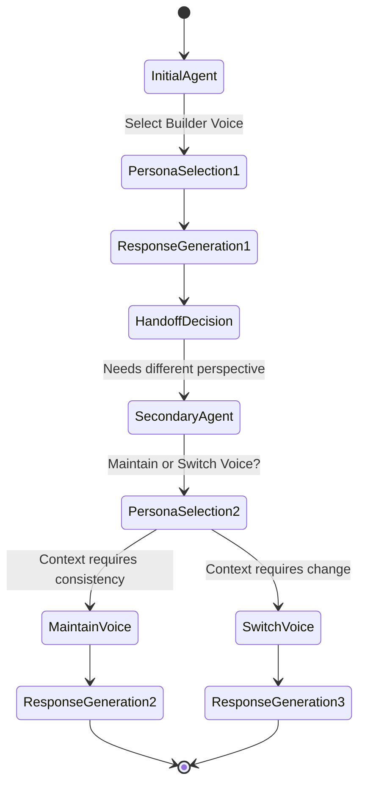

# Agent Communication Patterns & Interaction Flows

## Overview

This document details the communication patterns between WhisperSync agents, including message formats, handoff protocols, state synchronization, and collaborative processing workflows.

## 🔄 Core Communication Patterns

### 1. Direct Agent-to-Agent Communication

#### Pattern: Handoff Protocol
When an agent determines content is better suited for another agent:



**Message Format:**
```json
{
  "handoff_id": "uuid",
  "source_agent": "ExecutiveAgent",
  "target_agent": "GitHubAgent",
  "timestamp": "2024-01-15T10:30:00Z",
  "confidence": 0.85,
  "original_transcript": "...",
  "partial_analysis": {
    "work_context": "During sprint planning...",
    "extracted_idea": "We need a tool to automate...",
    "relevant_tags": ["automation", "tooling", "productivity"]
  },
  "handoff_reason": "embedded_project_idea",
  "preserve_context": true,
  "correlation_id": "original-request-id"
}
```

### 2. Broadcast Communication

#### Pattern: Theory of Mind Updates
When significant insights require all agents to update their understanding:



**Broadcast Message:**
```json
{
  "update_type": "life_phase_transition",
  "source_agent": "SpiritualAgent",
  "confidence": 0.82,
  "changes": {
    "previous_phase": "exploration",
    "new_phase": "building",
    "indicators": [
      "increased_project_ideation",
      "future_focused_language",
      "energy_uptick"
    ]
  },
  "impact_areas": {
    "ExecutiveAgent": {
      "adjust_workload_recommendations": true,
      "expect_higher_capacity": true
    },
    "GitHubAgent": {
      "increase_project_complexity": true,
      "suggest_larger_scope": true
    }
  },
  "effective_date": "2024-01-15T00:00:00Z"
}
```

### 3. Collaborative Processing

#### Pattern: Multi-Agent Synthesis
For complex transcripts requiring multiple perspectives:



**Synthesis Request:**
```json
{
  "synthesis_id": "uuid",
  "transcript": "Today I realized while coding...",
  "agent_results": [
    {
      "agent": "ExecutiveAgent",
      "confidence": 0.7,
      "primary_insights": ["productivity_pattern", "skill_growth"],
      "proposed_actions": ["calendar_optimization", "learning_path"]
    },
    {
      "agent": "GitHubAgent", 
      "confidence": 0.6,
      "primary_insights": ["architecture_preference", "tool_opportunity"],
      "proposed_actions": ["create_tool_repo", "document_pattern"]
    },
    {
      "agent": "SpiritualAgent",
      "confidence": 0.9,
      "primary_insights": ["growth_moment", "self_awareness"],
      "proposed_actions": ["reflection_prompt", "gratitude_note"]
    }
  ],
  "synthesis_strategy": "weighted_merge"
}
```

## 📊 State Synchronization Patterns

### 1. Optimistic Updates with Reconciliation

```python
class OptimisticStateUpdate:
    """
    Agents make local updates optimistically and reconcile conflicts.
    """
    
    def update_local_state(self, agent_id: str, update: StateUpdate):
        # 1. Apply update locally immediately
        local_state = self.apply_update(self.local_cache[agent_id], update)
        
        # 2. Send to shared state asynchronously
        message = {
            'agent_id': agent_id,
            'update': update,
            'local_version': local_state.version,
            'timestamp': datetime.utcnow().isoformat()
        }
        
        self.state_queue.send_message(MessageBody=json.dumps(message))
        
        # 3. Handle reconciliation on response
        return local_state
    
    def reconcile_state(self, agent_id: str, authoritative_state: State):
        local_state = self.local_cache[agent_id]
        
        if local_state.version < authoritative_state.version:
            # Accept authoritative state
            self.local_cache[agent_id] = authoritative_state
        elif local_state.version > authoritative_state.version:
            # Re-submit local changes
            self.resubmit_local_changes(agent_id)
        else:
            # States match, no action needed
            pass
```

### 2. Event-Driven State Updates



## 🔗 Knowledge Sharing Patterns

### 1. Shared Context Window

Agents maintain a shared context of recent interactions:

```python
@dataclass
class SharedContext:
    """
    Rolling window of recent interactions shared across agents.
    """
    window_size: int = 10
    entries: List[ContextEntry] = field(default_factory=list)
    
    def add_entry(self, entry: ContextEntry):
        self.entries.append(entry)
        # Maintain window size
        if len(self.entries) > self.window_size:
            self.entries.pop(0)
    
    def get_relevant_context(self, agent_type: str) -> List[ContextEntry]:
        # Filter context relevant to specific agent
        return [
            entry for entry in self.entries
            if agent_type in entry.relevant_agents
        ]

@dataclass
class ContextEntry:
    timestamp: datetime
    source_agent: str
    interaction_type: str
    key_insights: List[str]
    emotional_tone: str
    relevant_agents: List[str]
    ttl: int = 3600  # 1 hour default
```

### 2. Insight Propagation

High-value insights propagate through the system:

```python
class InsightPropagation:
    def propagate_insight(self, insight: Insight):
        # Determine propagation strategy based on insight type
        if insight.impact_score > 0.8:
            # High impact: immediate broadcast
            self.broadcast_immediate(insight)
        elif insight.cross_domain:
            # Cross-domain: targeted distribution
            self.distribute_targeted(insight)
        else:
            # Low impact: passive availability
            self.store_passive(insight)
    
    def broadcast_immediate(self, insight: Insight):
        message = {
            'type': 'high_impact_insight',
            'insight': insight.to_dict(),
            'action_required': True,
            'ttl': 86400  # 24 hours
        }
        
        # Send to all agent queues
        for agent_queue in self.agent_queues:
            sqs.send_message(
                QueueUrl=agent_queue,
                MessageBody=json.dumps(message),
                MessageAttributes={
                    'priority': {'StringValue': 'high', 'DataType': 'String'}
                }
            )
```

## 🎭 Persona Coordination

### 1. Persona Handoff During Multi-Agent Response



### 2. Persona Consistency Protocol

```python
class PersonaConsistencyManager:
    def determine_persona_strategy(
        self,
        current_agent: str,
        previous_persona: Optional[VoicePersona],
        context: InteractionContext
    ) -> PersonaStrategy:
        
        # Check if we're in a continuous conversation
        if context.is_continuous and previous_persona:
            time_gap = context.current_time - context.last_interaction
            
            if time_gap < timedelta(minutes=5):
                # Maintain persona for conversational flow
                return PersonaStrategy(
                    action="maintain",
                    persona=previous_persona,
                    reason="conversational_continuity"
                )
        
        # Check for emotional context requiring consistency
        if context.emotional_intensity > 0.7:
            if context.emotion_type in ["grief", "joy", "fear"]:
                # Use empathetic friend voice regardless of agent
                return PersonaStrategy(
                    action="override",
                    persona=VoicePersona.FRIEND,
                    reason="emotional_support_needed"
                )
        
        # Default to agent-appropriate persona
        return PersonaStrategy(
            action="use_default",
            persona=self.get_default_persona(current_agent),
            reason="standard_selection"
        )
```

## 💾 Message Queue Architecture

### 1. Queue Configuration

```yaml
queues:
  - name: ExecutiveAgentQueue
    type: FIFO
    visibility_timeout: 300  # 5 minutes
    message_retention: 1209600  # 14 days
    dlq:
      name: ExecutiveAgentDLQ
      max_receive_count: 3
      
  - name: GitHubAgentQueue
    type: Standard
    visibility_timeout: 600  # 10 minutes (longer for repo creation)
    message_retention: 345600  # 4 days
    dlq:
      name: GitHubAgentDLQ
      max_receive_count: 2
      
  - name: SpiritualAgentQueue
    type: FIFO
    visibility_timeout: 300
    message_retention: 1209600
    dlq:
      name: SpiritualAgentDLQ
      max_receive_count: 3
      
  - name: HandoffQueue
    type: FIFO
    visibility_timeout: 60
    deduplication_scope: messageGroup
    content_based_deduplication: true
```

### 2. Message Priority Handling

```python
class PriorityMessageHandler:
    def process_messages(self, queue_url: str):
        # Separate high and normal priority processing
        high_priority = []
        normal_priority = []
        
        messages = sqs.receive_message(
            QueueUrl=queue_url,
            MaxNumberOfMessages=10,
            MessageAttributeNames=['priority']
        ).get('Messages', [])
        
        for message in messages:
            priority = message.get('MessageAttributes', {}).get(
                'priority', {}).get('StringValue', 'normal'
            )
            
            if priority == 'high':
                high_priority.append(message)
            else:
                normal_priority.append(message)
        
        # Process high priority first
        for message in high_priority:
            self.process_single_message(message, expedited=True)
        
        # Then normal priority
        for message in normal_priority:
            self.process_single_message(message, expedited=False)
```

## 🔍 Monitoring & Observability

### 1. Distributed Tracing

```python
class AgentTracer:
    def trace_interaction(self, correlation_id: str):
        # Create root span
        with tracer.start_as_current_span(
            "voice_memo_processing",
            attributes={
                "correlation_id": correlation_id,
                "service": "whispersync"
            }
        ) as root_span:
            
            # Trace classification
            with tracer.start_span("classification") as classify_span:
                classify_span.set_attribute("confidence", confidence)
                classify_span.set_attribute("agents_selected", agents)
            
            # Trace each agent processing
            for agent in agents:
                with tracer.start_span(f"agent_{agent}") as agent_span:
                    agent_span.set_attribute("agent_type", agent)
                    agent_span.set_attribute("processing_time", time)
                    agent_span.set_attribute("handoffs", handoff_count)
            
            # Trace synthesis if applicable
            if len(agents) > 1:
                with tracer.start_span("synthesis") as synth_span:
                    synth_span.set_attribute("agent_count", len(agents))
                    synth_span.set_attribute("strategy", "weighted_merge")
```

### 2. Communication Metrics

```python
@dataclass
class CommunicationMetrics:
    handoff_rate: float  # Percentage of requests handed off
    avg_handoff_confidence: float  # Average confidence in handoffs
    multi_agent_rate: float  # Percentage requiring multiple agents
    synthesis_time_p50: float  # Median synthesis time
    synthesis_time_p99: float  # 99th percentile synthesis time
    theory_update_frequency: float  # Updates per day
    knowledge_share_rate: float  # Insights shared per interaction
    persona_consistency_rate: float  # How often persona is maintained
    
    def to_cloudwatch(self):
        metrics = []
        for field, value in self.__dict__.items():
            metrics.append({
                'MetricName': field,
                'Value': value,
                'Unit': 'None' if 'rate' in field else 'Milliseconds',
                'Timestamp': datetime.utcnow()
            })
        return metrics
```

## 🔄 Error Handling & Recovery

### 1. Circuit Breaker Pattern

```python
class AgentCircuitBreaker:
    def __init__(self, failure_threshold: int = 5, timeout: int = 60):
        self.failure_threshold = failure_threshold
        self.timeout = timeout
        self.failures = defaultdict(int)
        self.last_failure_time = defaultdict(datetime)
        self.state = defaultdict(lambda: "closed")  # closed, open, half-open
    
    def call_agent(self, agent_name: str, request: Dict) -> Dict:
        if self.state[agent_name] == "open":
            if self._should_attempt_reset(agent_name):
                self.state[agent_name] = "half-open"
            else:
                raise CircuitOpenError(f"{agent_name} circuit is open")
        
        try:
            response = self._execute_agent_call(agent_name, request)
            self._on_success(agent_name)
            return response
        except Exception as e:
            self._on_failure(agent_name)
            raise
    
    def _on_failure(self, agent_name: str):
        self.failures[agent_name] += 1
        self.last_failure_time[agent_name] = datetime.utcnow()
        
        if self.failures[agent_name] >= self.failure_threshold:
            self.state[agent_name] = "open"
            logger.error(f"Circuit breaker opened for {agent_name}")
```

### 2. Fallback Strategies

```python
class FallbackHandler:
    def handle_agent_failure(
        self,
        failed_agent: str,
        request: Dict,
        error: Exception
    ) -> Dict:
        
        # Strategy 1: Try alternate agent
        if alternate := self.get_alternate_agent(failed_agent):
            logger.info(f"Falling back from {failed_agent} to {alternate}")
            return self.invoke_agent(alternate, request)
        
        # Strategy 2: Use cached response if available
        if cached := self.get_cached_response(request):
            logger.info(f"Using cached response for failed {failed_agent}")
            return cached
        
        # Strategy 3: Degrade gracefully
        logger.warning(f"No fallback available for {failed_agent}")
        return {
            'status': 'degraded',
            'message': 'Processing temporarily unavailable',
            'retry_after': 300,
            'partial_result': self.get_partial_result(request)
        }
```

## 🎯 Best Practices

### 1. Message Design
- Include correlation IDs for tracing
- Version all message formats
- Include TTL for time-sensitive data
- Compress large payloads

### 2. Queue Management
- Use FIFO for order-sensitive operations
- Implement exponential backoff
- Monitor queue depth
- Set appropriate visibility timeouts

### 3. State Consistency
- Prefer eventual consistency
- Use optimistic concurrency
- Implement conflict resolution
- Version all state changes

### 4. Performance
- Batch operations where possible
- Cache Theory of Mind in Lambda
- Use connection pooling
- Implement request coalescing

---

This communication architecture ensures reliable, scalable, and intelligent interaction between agents while maintaining system coherence and user experience quality.