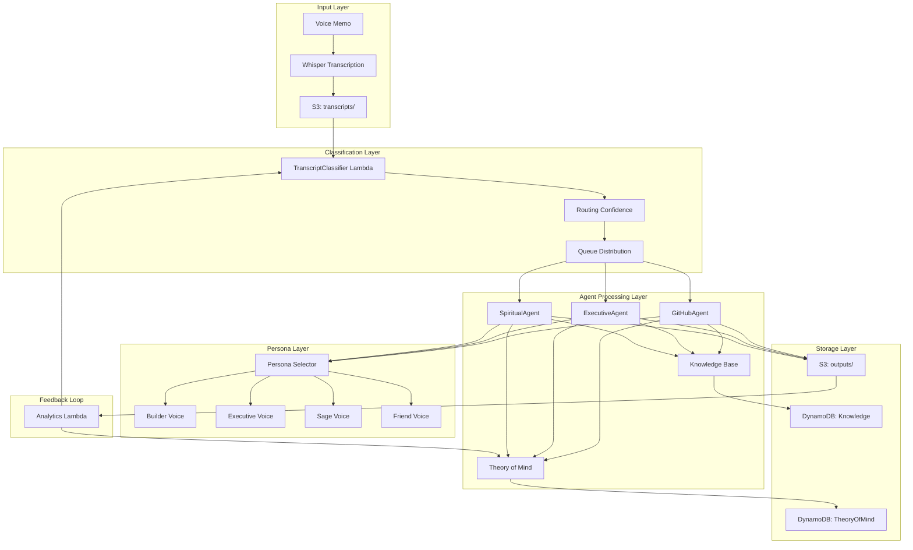

# Enhanced WhisperSync Agent Architecture

## Executive Summary

This document defines the architecture for an enhanced WhisperSync system that evolves from simple voice-to-action routing to an intelligent, persona-aware system with Theory of Mind capabilities. The design maintains backward compatibility while introducing sophisticated agent communication, evolving knowledge structures, and multi-modal persona layers.

## 🎯 Core Architecture Principles

### 1. **Agent Specialization with Overlap**
- Three core agents with distinct primary responsibilities
- Shared knowledge base allows cross-domain insights
- Graceful handoff between agents for complex thoughts

### 2. **Theory of Mind Evolution**
- User model that deepens over time
- Confidence scores that increase with interaction
- Cautious updates to prevent model drift

### 3. **Persona Layer Abstraction**
- Voice personas separate from agent logic
- Dynamic persona selection based on context
- Emotional intelligence in voice responses

### 4. **Organic Knowledge Growth**
- Event-sourced memory architecture
- Time-decay for relevance
- Connection discovery between memories

## 🏗️ System Architecture Overview



## 🤖 Enhanced Agent Specifications

### 1. GitHubAgent (formerly OvernightMVP)
**Primary Role**: Transform ideas into executable projects

**Enhanced Capabilities**:
- Learns user's technical preferences over time
- Suggests architecture based on past projects
- Cross-references with ExecutiveAgent for work alignment
- Tracks project success metrics

**Theory of Mind Integration**:
```python
{
    "technical_preferences": {
        "languages": {"python": 0.8, "typescript": 0.6},
        "frameworks": {"aws_cdk": 0.9, "react": 0.5},
        "architecture_style": "serverless_first"
    },
    "project_patterns": {
        "completion_rate": 0.65,
        "typical_scope": "weekend_mvp",
        "interest_decay": "2_weeks"
    }
}
```

### 2. ExecutiveAgent (enhanced)
**Primary Role**: Professional life management and strategic insights

**Enhanced Capabilities**:
- Maintains work identity model
- Predicts energy patterns
- Suggests optimal task timing
- Identifies career trajectory

**Theory of Mind Integration**:
```python
{
    "professional_identity": {
        "roles": ["builder", "leader", "innovator"],
        "values": ["autonomy", "impact", "growth"],
        "energy_patterns": {
            "high_energy_hours": [9, 10, 14, 15],
            "low_energy_days": ["friday"],
            "optimal_deep_work": "morning"
        }
    },
    "career_trajectory": {
        "current_phase": "scaling",
        "next_milestone": "product_launch",
        "growth_areas": ["delegation", "strategy"]
    }
}
```

### 3. SpiritualAgent (enhanced)
**Primary Role**: Personal growth and emotional intelligence

**Enhanced Capabilities**:
- Deep pattern recognition across memories
- Emotional baseline tracking
- Life phase detection
- Wisdom extraction and synthesis

**Theory of Mind Integration**:
```python
{
    "emotional_baseline": {
        "default_state": "contemplative",
        "stress_indicators": ["rushed_speech", "future_focus"],
        "joy_indicators": ["gratitude", "present_tense"]
    },
    "life_patterns": {
        "recurring_themes": ["resilience", "connection", "purpose"],
        "growth_edges": ["patience", "trust"],
        "sacred_relationships": ["children", "nature"]
    }
}
```

## 🧠 Theory of Mind Architecture

### Data Structure
```python
@dataclass
class TheoryOfMind:
    # Identity Layer (slow-changing)
    core_identity: CoreIdentity
    
    # Behavioral Layer (medium-changing)
    behavioral_patterns: BehavioralPatterns
    
    # State Layer (fast-changing)
    current_state: CurrentState
    
    # Meta Layer
    confidence_scores: Dict[str, float]
    last_updated: datetime
    interaction_count: int
    model_version: str

@dataclass
class CoreIdentity:
    values: List[WeightedValue]
    life_roles: List[str]
    core_beliefs: Dict[str, str]
    personality_traits: Dict[str, float]  # Big-5 model

@dataclass
class BehavioralPatterns:
    communication_style: Dict[str, Any]
    decision_making: DecisionProfile
    time_patterns: TemporalPatterns
    social_graph: SocialNetwork

@dataclass
class CurrentState:
    energy_level: float
    focus_areas: List[str]
    active_projects: List[Project]
    emotional_state: EmotionalState
    recent_context: List[ContextualMemory]
```

### Update Mechanism
```python
class TheoryOfMindEvolution:
    def update(self, new_observation: Observation) -> TheoryOfMind:
        # Calculate confidence in update
        confidence = self.calculate_confidence(new_observation)
        
        # Different thresholds for different layers
        if confidence > 0.9 and new_observation.impacts_core:
            # Very rare - core identity shift
            self.update_core_identity(new_observation)
        elif confidence > 0.7:
            # Behavioral pattern update
            self.update_behavioral_patterns(new_observation)
        else:
            # Always update current state
            self.update_current_state(new_observation)
        
        # Increase overall confidence with each interaction
        self.confidence_scores['overall'] = min(
            0.95,  # Cap at 95% confidence
            self.confidence_scores['overall'] + 0.01
        )
        
        return self.theory_of_mind
```

## 🎭 Persona Layer Design

### Voice Personas (ElevenLabs Integration)

#### 1. **Builder Voice** (GitHubAgent)
- **Tone**: Enthusiastic, creative, possibility-focused
- **Characteristics**: 
  - Quick speech when excited
  - Uses technical metaphors
  - Future-tense oriented
- **Trigger Context**: New ideas, technical discussions, problem-solving

#### 2. **Executive Voice** (ExecutiveAgent)
- **Tone**: Confident, strategic, measured
- **Characteristics**:
  - Clear articulation
  - Strategic language
  - Balanced tempo
- **Trigger Context**: Work summaries, planning, professional updates

#### 3. **Sage Voice** (SpiritualAgent - significant memories)
- **Tone**: Warm, wise, contemplative
- **Characteristics**:
  - Slower, thoughtful pace
  - Philosophical undertones
  - Compassionate inflection
- **Trigger Context**: Life reviews, significant memories, growth insights

#### 4. **Friend Voice** (SpiritualAgent - daily memories)
- **Tone**: Casual, empathetic, supportive
- **Characteristics**:
  - Natural, conversational
  - Emotional mirroring
  - Gentle humor when appropriate
- **Trigger Context**: Daily memories, emotional support, celebration

### Persona Selection Logic
```python
class PersonaSelector:
    def select_persona(
        self,
        agent_type: str,
        content_analysis: Dict,
        theory_of_mind: TheoryOfMind
    ) -> VoicePersona:
        
        # Base selection on agent type
        base_persona = self.agent_persona_map[agent_type]
        
        # Adjust based on content
        if content_analysis['emotional_intensity'] > 0.8:
            if content_analysis['sentiment'] == 'positive':
                return self.get_celebration_variant(base_persona)
            else:
                return self.get_support_variant(base_persona)
        
        # Adjust based on user state
        if theory_of_mind.current_state.energy_level < 0.3:
            return self.get_gentle_variant(base_persona)
        
        return base_persona
```

## 📊 Agent Communication Patterns

### 1. **Direct Handoff Pattern**
When an agent recognizes content better suited for another:

```python
class AgentHandoff:
    source_agent: str
    target_agent: str
    confidence: float
    context: Dict[str, Any]
    partial_processing: Dict[str, Any]
    
    def execute(self):
        # Preserve context and partial work
        handoff_message = {
            'original_agent': self.source_agent,
            'partial_analysis': self.partial_processing,
            'handoff_reason': self.context['reason'],
            'preserve_persona': self.context.get('maintain_voice', False)
        }
        
        # Send to target agent queue
        sqs.send_message(
            QueueUrl=AGENT_QUEUES[self.target_agent],
            MessageBody=json.dumps(handoff_message)
        )
```

### 2. **Collaborative Processing Pattern**
For complex transcripts spanning multiple domains:

```python
class CollaborativeProcessor:
    def process(self, transcript: str, agents: List[str]):
        # Each agent processes independently
        results = []
        for agent in agents:
            result = self.invoke_agent(agent, transcript)
            results.append(result)
        
        # Synthesize results
        synthesis = self.synthesize_perspectives(results)
        
        # Update Theory of Mind with multi-perspective insights
        self.update_theory_of_mind(synthesis)
        
        return synthesis
```

### 3. **Knowledge Sharing Pattern**
Agents share insights through the knowledge base:

```python
class KnowledgeShare:
    def share_insight(
        self,
        insight: Insight,
        source_agent: str,
        visibility: List[str]  # Which agents can see this
    ):
        # Store in shared knowledge base
        dynamodb.put_item(
            TableName='SharedKnowledge',
            Item={
                'insight_id': insight.id,
                'source_agent': source_agent,
                'visibility': visibility,
                'confidence': insight.confidence,
                'timestamp': datetime.utcnow().isoformat(),
                'ttl': int(time.time()) + (90 * 24 * 60 * 60),  # 90 day TTL
                'content': insight.content,
                'category': insight.category
            }
        )
```

## 💾 State Management Architecture

### 1. **Event Sourcing for Memory**
All memories stored as immutable events:

```python
@dataclass
class MemoryEvent:
    event_id: str
    event_type: str  # 'memory_created', 'connection_found', 'insight_derived'
    timestamp: datetime
    agent: str
    content: Dict[str, Any]
    metadata: Dict[str, Any]
    
    def to_dynamodb_item(self):
        return {
            'PK': f"USER#{self.metadata['user_id']}",
            'SK': f"EVENT#{self.timestamp.isoformat()}#{self.event_id}",
            'event_type': self.event_type,
            'agent': self.agent,
            'content': json.dumps(self.content),
            'ttl': self.calculate_ttl()
        }
```

### 2. **State Aggregation**
Periodic aggregation of events into current state:

```python
class StateAggregator:
    def aggregate_user_state(self, user_id: str) -> UserState:
        # Get all events for user
        events = self.get_user_events(user_id)
        
        # Build state by replaying events
        state = UserState()
        for event in events:
            state = self.apply_event(state, event)
        
        # Cache aggregated state
        self.cache_state(user_id, state)
        
        return state
```

### 3. **Cross-Agent State Sync**
Ensures consistency across agents:

```python
class StateSynchronizer:
    def sync_theory_of_mind(self, update: TheoryOfMindUpdate):
        # Broadcast update to all agents
        sns.publish(
            TopicArn=THEORY_OF_MIND_TOPIC,
            Message=json.dumps({
                'update_type': update.type,
                'agent_source': update.source_agent,
                'changes': update.changes,
                'confidence': update.confidence,
                'timestamp': update.timestamp
            })
        )
```

## 🔄 Knowledge Evolution Patterns

### 1. **Organic Growth**
Knowledge accumulates naturally:

```python
class KnowledgeGraph:
    def add_memory(self, memory: Memory):
        # Add to graph
        node = self.create_node(memory)
        
        # Find connections (limit to prevent explosion)
        connections = self.find_connections(node, max_connections=5)
        
        # Create edges with weights
        for connection in connections:
            weight = self.calculate_connection_strength(node, connection)
            self.add_edge(node, connection, weight)
        
        # Trigger insight detection
        if len(connections) >= 3:
            self.detect_patterns(node, connections)
```

### 2. **Time-Weighted Relevance**
Recent memories have higher weight:

```python
def calculate_relevance(memory: Memory, current_time: datetime) -> float:
    age_days = (current_time - memory.timestamp).days
    
    # Base relevance from significance
    base_relevance = memory.significance / 10.0
    
    # Time decay factor
    decay_factor = math.exp(-age_days / 365.0)  # Half-life of 1 year
    
    # Boost for recurring themes
    theme_boost = len(memory.recurring_themes) * 0.1
    
    return min(1.0, base_relevance * decay_factor + theme_boost)
```

### 3. **Pattern Recognition**
Identify recurring patterns across time:

```python
class PatternDetector:
    def detect_life_patterns(self, user_id: str, timeframe: int = 90):
        memories = self.get_memories(user_id, days=timeframe)
        
        # Extract patterns
        patterns = {
            'temporal': self.find_temporal_patterns(memories),
            'emotional': self.find_emotional_patterns(memories),
            'thematic': self.find_thematic_patterns(memories),
            'social': self.find_social_patterns(memories)
        }
        
        # Generate insights
        insights = self.synthesize_patterns(patterns)
        
        # Update Theory of Mind
        if insights.confidence > 0.7:
            self.update_behavioral_patterns(user_id, insights)
        
        return insights
```

## 🚀 Scalability Considerations

### 1. **Agent Scaling**
- Each agent runs independently in Lambda
- SQS queues provide natural buffering
- DynamoDB on-demand scaling for state

### 2. **Memory Scaling**
- S3 for unlimited memory storage
- DynamoDB for fast pattern queries
- ElasticSearch for future semantic search

### 3. **Performance Optimization**
- Theory of Mind cached in Lambda memory
- Batch processing for pattern detection
- Async persona generation

## 🔒 Privacy & Security

### 1. **Data Encryption**
- All memories encrypted at rest
- Theory of Mind in encrypted DynamoDB
- Secrets Manager for sensitive context

### 2. **Access Control**
- Agent-specific IAM roles
- Scoped access to knowledge base
- Audit trail for all updates

### 3. **Data Retention**
- Configurable retention policies
- Right to deletion support
- Anonymized analytics only

## 📈 Monitoring & Analytics

### 1. **Agent Performance**
```python
{
    "routing_accuracy": 0.95,
    "handoff_rate": 0.12,
    "processing_time_p99": 2.5,
    "theory_updates_per_day": 15,
    "confidence_growth_rate": 0.01
}
```

### 2. **User Insights**
```python
{
    "dominant_agent_usage": {
        "spiritual": 0.45,
        "executive": 0.35,
        "github": 0.20
    },
    "memory_significance_avg": 6.8,
    "pattern_detection_rate": 0.73,
    "persona_satisfaction": 0.89
}
```

### 3. **System Health**
- CloudWatch dashboards per agent
- X-Ray for distributed tracing
- Alarms for degraded performance

## 🎯 Implementation Roadmap

### Phase 1: Foundation (Weeks 1-2)
- [ ] Implement enhanced Theory of Mind structure
- [ ] Create DynamoDB tables for state management
- [ ] Update agents with new capabilities
- [ ] Basic persona selection logic

### Phase 2: Intelligence (Weeks 3-4)
- [ ] Pattern detection algorithms
- [ ] Agent handoff mechanisms
- [ ] Knowledge sharing implementation
- [ ] Confidence scoring system

### Phase 3: Personality (Weeks 5-6)
- [ ] ElevenLabs integration
- [ ] Persona voice training
- [ ] Dynamic persona selection
- [ ] Emotional intelligence enhancement

### Phase 4: Evolution (Weeks 7-8)
- [ ] Long-term memory patterns
- [ ] Cross-agent insights
- [ ] Advanced Theory of Mind updates
- [ ] Performance optimization

## 🌟 Future Enhancements

### 1. **Multi-User Support**
- User-specific Theory of Mind
- Shared knowledge spaces
- Privacy boundaries

### 2. **Predictive Capabilities**
- Anticipate user needs
- Proactive suggestions
- Energy level predictions

### 3. **Advanced Personas**
- Custom voice training
- Personality evolution
- Contextual humor

### 4. **External Integrations**
- Calendar optimization
- Task management
- Health tracking

---

This architecture provides a foundation for a deeply personal, evolving AI system that grows more intelligent and personalized with each interaction while maintaining clear boundaries and respect for the user's autonomy.