# Interaction Diagrams & Data Flow Specifications

## Overview

This document provides detailed interaction diagrams and data flow specifications for the enhanced WhisperSync agent system, illustrating how voice memos transform into intelligent, personalized responses through multiple processing layers.

## 🌊 Complete System Data Flow

### End-to-End Voice Memo Processing


## 📊 Detailed Interaction Sequences

### 1. Single Agent Processing Flow


### 2. Multi-Agent Collaboration Flow


### 3. Theory of Mind Evolution Flow


### 4. Persona Selection Decision Tree


## 🔄 Data Transformation Pipeline

### Voice Memo to Actionable Insight

```yaml
Stage 1 - Raw Input:
  Input: Audio file (m4a, wav, mp3)
  Output: 
    Format: UTF-8 text
    Structure: Unstructured natural language
    Metadata:
      - timestamp
      - duration
      - source_device

Stage 2 - Classification:
  Input: Raw transcript text
  Process:
    - Sentiment analysis
    - Theme extraction
    - Entity recognition
    - Confidence scoring
  Output:
    Format: ClassificationResult
    Fields:
      - primary_agent: string
      - confidence: float (0.0-1.0)
      - themes: string[]
      - entities: Entity[]
      - emotional_tone: EmotionalProfile

Stage 3 - Agent Processing:
  Input: ClassificationResult + Transcript
  Context Loading:
    - Theory of Mind state
    - Recent interaction history
    - Knowledge base queries
  Processing:
    ExecutiveAgent:
      - Work pattern analysis
      - Task extraction
      - Priority assessment
      - Energy level inference
    GitHubAgent:
      - Technical concept extraction
      - Architecture planning
      - Implementation roadmap
      - Technology selection
    SpiritualAgent:
      - Emotional processing
      - Memory significance scoring
      - Life pattern recognition
      - Growth insight extraction
  Output:
    Format: AgentResponse
    Fields:
      - processed_content: ProcessedMemory
      - suggested_actions: Action[]
      - theory_updates: TheoryUpdate[]
      - storage_paths: string[]

Stage 4 - Synthesis:
  Input: AgentResponse(s)
  Multi-Agent Synthesis:
    - Weight responses by confidence
    - Resolve conflicts
    - Merge insights
    - Select primary narrative
  Persona Selection:
    - Analyze emotional context
    - Check Theory of Mind state
    - Apply selection rules
    - Choose voice variation
  Output:
    Format: SynthesizedResponse
    Fields:
      - text_response: string
      - voice_persona: PersonaConfig
      - merged_insights: Insight[]
      - combined_actions: Action[]

Stage 5 - Voice Generation:
  Input: SynthesizedResponse
  Processing:
    - Text preparation (SSML)
    - Prosody marking
    - Emotion injection
    - Voice synthesis (ElevenLabs)
  Output:
    Format: VoiceOutput
    Fields:
      - audio_url: string
      - duration: number
      - transcript: string
      - synthesis_metadata: object

Stage 6 - Storage & Analytics:
  Input: Complete processing result
  Storage:
    S3 Structure:
      - /transcripts/{date}/{id}.txt
      - /outputs/{agent}/{date}/{id}.json
      - /audio/{date}/{id}.mp3
      - /analytics/{date}/summary.json
  Analytics Events:
    - Processing metrics
    - Agent performance
    - User patterns
    - System health
```

## 📐 Component Interaction Specifications

### 1. Queue Message Formats

```typescript
// Classification to Agent Queue
interface AgentQueueMessage {
  messageId: string;
  correlationId: string;
  timestamp: string;
  
  // Core data
  transcript: string;
  s3Key: string;
  bucket: string;
  
  // Classification results
  classification: {
    agent: AgentType;
    confidence: number;
    themes: string[];
    sentiment: SentimentProfile;
    entities: Entity[];
  };
  
  // Routing metadata
  routing: {
    isPrimary: boolean;
    secondaryAgents?: AgentType[];
    handoffFrom?: string;
    priority: 'normal' | 'high';
  };
  
  // Context
  context: {
    userId: string;
    sessionId?: string;
    previousInteraction?: string;
  };
}

// Agent to Agent Handoff
interface HandoffMessage {
  handoffId: string;
  sourceAgent: AgentType;
  targetAgent: AgentType;
  timestamp: string;
  
  // Original data
  originalTranscript: string;
  originalClassification: Classification;
  
  // Partial processing
  partialAnalysis: {
    extractedConcepts: Concept[];
    identifiedOpportunity: string;
    confidence: number;
    processingNotes: string;
  };
  
  // Handoff metadata
  handoffReason: HandoffReason;
  suggestedPersona?: VoicePersona;
  preserveContext: boolean;
}

// Theory of Mind Update Broadcast
interface TheoryUpdateMessage {
  updateId: string;
  timestamp: string;
  source: AgentType;
  
  // Update details
  update: {
    layer: TheoryLayer;
    changes: Record<string, any>;
    confidence: number;
    evidence: Evidence[];
  };
  
  // Impact assessment
  impact: {
    affectedAgents: AgentType[];
    suggestedAdaptations: Adaptation[];
    risk: RiskLevel;
  };
  
  // Validation
  validation: {
    checksPerformed: ValidationCheck[];
    allPassed: boolean;
    warnings: string[];
  };
}
```

### 2. State Synchronization Protocol

```typescript
class StateSyncProtocol {
  // State change event
  interface StateChangeEvent {
    eventId: string;
    timestamp: string;
    eventType: 'create' | 'update' | 'delete';
    
    // What changed
    stateType: 'theory_of_mind' | 'knowledge' | 'memory';
    entityId: string;
    changes: StateDelta;
    
    // Causality
    triggeredBy: {
      source: 'agent' | 'user' | 'system';
      agentId?: string;
      reason: string;
    };
    
    // Ordering
    vectorClock: VectorClock;
    dependsOn: string[]; // Previous event IDs
  }
  
  // Synchronization checkpoint
  interface SyncCheckpoint {
    checkpointId: string;
    timestamp: string;
    
    // State snapshot
    states: {
      theoryOfMind: TheorySnapshot;
      knowledgeBase: KnowledgeSnapshot;
      recentMemories: MemorySnapshot;
    };
    
    // Consistency markers
    consistency: {
      lastEventId: string;
      eventCount: number;
      checksum: string;
    };
  }
  
  // Conflict resolution
  interface ConflictResolution {
    conflictId: string;
    detectedAt: string;
    
    // Conflicting updates
    updates: ConflictingUpdate[];
    
    // Resolution strategy
    strategy: 'last_write_wins' | 'merge' | 'user_override';
    resolution: StateUpdate;
    
    // Notification
    notifyAgents: AgentType[];
    requiresUserReview: boolean;
  }
}
```

### 3. Performance Monitoring Events

```typescript
interface PerformanceEvent {
  // Identification
  eventId: string;
  timestamp: string;
  correlationId: string;
  
  // Timing
  timings: {
    totalDuration: number;
    stages: {
      classification: number;
      agentProcessing: number;
      synthesis: number;
      voiceGeneration: number;
    };
  };
  
  // Resource usage
  resources: {
    lambdaMemoryUsed: number;
    lambdaDuration: number;
    apiCalls: {
      elevenlabs: number;
      anthropic: number;
      dynamodb: number;
      s3: number;
    };
  };
  
  // Quality metrics
  quality: {
    classificationConfidence: number;
    agentConfidence: number;
    synthesisCoherence: number;
    voiceNaturalness: number;
  };
  
  // Errors and warnings
  issues: {
    errors: ErrorDetail[];
    warnings: string[];
    retries: RetryInfo[];
  };
}
```

## 🔍 Detailed Processing Examples

### Example 1: Complex Work Memory with Embedded Idea


### Example 2: Emotional Memory Triggering Sage Response

```mermaid
sequenceDiagram
    participant User
    participant System
    participant Spiritual as SpiritualAgent
    participant Theory as Theory of Mind
    participant Persona
    participant Voice
    
    User->>System: "Sitting by the ocean, I realized<br/>how much I've grown since the divorce.<br/>The waves remind me that everything changes."
    
    System->>System: Emotional analysis
    Note over System: Emotion: Contemplative (0.8)<br/>Significance: High (9/10)<br/>Themes: Growth, Change, Ocean
    
    System->>Spiritual: Process profound memory
    
    Spiritual->>Theory: Load emotional patterns
    Theory-->>Spiritual: Divorce mentioned 3 months ago<br/>Growth theme increasing<br/>Nature as healing pattern
    
    Spiritual->>Spiritual: Deep analysis
    Note over Spiritual: Life phase: Integration<br/>Growth edge: Acceptance<br/>Wisdom emerging: Impermanence
    
    Spiritual->>Persona: Request Sage voice
    Note over Persona: High significance<br/>Philosophical content<br/>Contemplative mood
    
    Persona-->>Spiritual: Sage persona confirmed
    
    Spiritual->>Voice: Generate response
    Note over Voice: Pace: Slow<br/>Tone: Warm, wise<br/>Pauses: Meaningful
    
    Voice->>User: "The ocean has always been<br/>a wise teacher... *pause*<br/>Your recognition of growth<br/>through change is profound..."
    
    Spiritual->>Theory: Update life phase
    Note over Theory: Phase: Healing → Integration<br/>Confidence: 0.85
```



## 📈 Analytics Data Flow

### Event Collection Pipeline

```yaml
Event Sources:
  - Transcript Classification
  - Agent Processing
  - Theory of Mind Updates  
  - Voice Synthesis
  - User Interactions

Event Stream:
  Format: JSON Lines
  Destination: Kinesis Data Streams
  Partitioning: By userId and date
  
Processing:
  Real-time:
    - Lambda processors
    - DynamoDB updates
    - CloudWatch metrics
  
  Batch:
    - Daily aggregations
    - Weekly summaries
    - Monthly reports
    
Storage:
  Hot (< 7 days):
    - DynamoDB
    - ElasticSearch
    
  Warm (7-90 days):
    - S3 Standard
    - Athena queryable
    
  Cold (> 90 days):
    - S3 Glacier
    - Lifecycle policies

Dashboards:
  Real-time:
    - Agent performance
    - System health
    - Active users
    
  Analytics:
    - User patterns
    - Agent accuracy
    - Theory evolution
    - Voice satisfaction
```

## 🚨 Error Handling Flows

### Graceful Degradation Strategy


---

This comprehensive data flow architecture ensures smooth, intelligent processing of voice memos while maintaining system reliability and user experience quality through careful orchestration of all components.