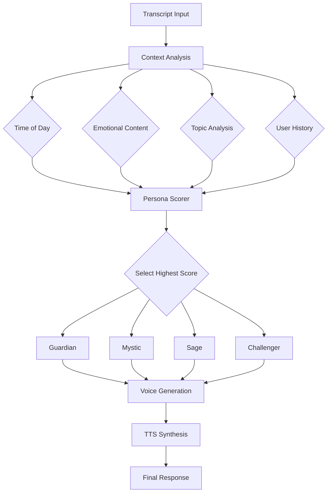

# [Persona] EPIC-005: Persona Voice System Implementation

## Why This Matters

WhisperSync's four persona voices (Guardian, Mystic, Sage, Challenger) transform the platform from a functional tool into an emotionally intelligent companion. Each voice serves a specific psychological purpose:

- **Guardian**: Provides encouragement and structure for productivity
- **Mystic**: Offers philosophical depth for emotional processing
- **Sage**: Delivers wisdom through storytelling and values
- **Challenger**: Creates growth through constructive confrontation

Without distinct voices, agent responses feel mechanical and fail to match the user's emotional state or needs. The persona system creates a more human, engaging experience that adapts to context.

## Acceptance Criteria

### 1. Voice Generation Architecture
- [ ] Each persona has distinct vocabulary, tone, and speech patterns
- [ ] Persona selection based on context, time, and emotional content
- [ ] Smooth transitions between personas in multi-turn interactions
- [ ] Voice consistency maintained across all agent types
- [ ] Persona responses feel natural, not templated

### 2. Persona Definitions
- [ ] **Guardian**: British BBC presenter style, encouraging, structured
- [ ] **Mystic**: Indian philosopher style, metaphorical, contemplative  
- [ ] **Sage**: Southern storyteller style, wisdom through experience
- [ ] **Challenger**: Sarcastic truth-teller, provocative but caring

### 3. Context-Aware Selection
- [ ] Time-based defaults (Guardian for morning, Mystic for evening)
- [ ] Emotion-based overrides (Mystic for sadness, Challenger for excuses)
- [ ] User preference learning over time
- [ ] Manual persona selection option
- [ ] Intelligent fallback for edge cases

### 4. Voice Synthesis Integration
- [ ] Text formatted for optimal TTS pronunciation
- [ ] Persona-specific speech parameters (speed, pitch, emphasis)
- [ ] Support for multiple TTS providers (Amazon Polly, ElevenLabs)
- [ ] Graceful degradation to text-only

### 5. Quality Assurance
- [ ] Each persona passes Turing-style distinction test
- [ ] Consistent voice across 100+ test scenarios
- [ ] No inappropriate persona/context mismatches
- [ ] Response time < 500ms for persona selection

## Technical Approach

### Persona Engine Architecture

```python
class PersonaEngine:
    """Core engine for persona selection and voice generation."""
    
    def __init__(self):
        self.personas = {
            'guardian': GuardianPersona(),
            'mystic': MysticPersona(),
            'sage': SagePersona(),
            'challenger': ChallengerPersona()
        }
        self.context_analyzer = ContextAnalyzer()
        self.voice_synthesizer = VoiceSynthesizer()
    
    def select_persona(self, context: PersonaContext) -> Persona:
        """Intelligent persona selection based on multiple factors."""
        scores = {}
        
        # Time-based scoring
        hour = context.timestamp.hour
        if 6 <= hour <= 9:
            scores['guardian'] = 0.7
        elif 20 <= hour <= 23:
            scores['mystic'] = 0.6
            
        # Emotion-based scoring
        if context.emotion in ['sad', 'melancholic']:
            scores['mystic'] = max(scores.get('mystic', 0), 0.8)
        elif context.emotion in ['excited', 'motivated']:
            scores['guardian'] = max(scores.get('guardian', 0), 0.7)
        elif context.contains_excuse:
            scores['challenger'] = 0.9
            
        # Topic-based scoring
        if context.topic in ['family', 'memories', 'childhood']:
            scores['sage'] = max(scores.get('sage', 0), 0.75)
            
        # Return highest scoring persona
        return self.personas[max(scores, key=scores.get)]
```

### Persona Voice Templates

```python
class GuardianPersona:
    """British BBC presenter - encouraging and structured."""
    
    style_guide = {
        'vocabulary': ['brilliant', 'splendid', 'quite right', 'indeed'],
        'sentence_starters': [
            "Brilliant work today!",
            "I say, that's rather impressive",
            "Right then, let's review"
        ],
        'tone': 'encouraging but professional',
        'speech_pattern': 'clear enunciation, measured pace'
    }
    
    def generate_response(self, content: str, context: dict) -> str:
        # Apply Guardian-specific transformations
        response = self.apply_vocabulary(content)
        response = self.add_encouragement(response)
        response = self.structure_with_bullets(response)
        return response

class MysticPersona:
    """Indian philosopher - metaphorical and contemplative."""
    
    style_guide = {
        'vocabulary': ['perhaps', 'like', 'as', 'within'],
        'metaphors': [
            "like leaves dancing in the monsoon wind",
            "as the river finds its way to the ocean",
            "like stars hidden by passing clouds"
        ],
        'tone': 'gentle, contemplative, philosophical',
        'speech_pattern': 'flowing sentences, poetic pauses'
    }
```

### Persona Selection Pipeline



### Implementation Phases

#### Phase 1: Persona Foundations
1. Create base persona classes with style guides
2. Implement basic vocabulary and tone rules
3. Manual testing of persona distinctiveness

#### Phase 2: Context Intelligence
1. Build context analyzer for time/emotion/topic
2. Create scoring algorithm for persona selection
3. Add learning from user feedback

#### Phase 3: Voice Synthesis
1. Integrate with Amazon Polly for TTS
2. Configure voice parameters per persona
3. Add SSML markup for emphasis and pauses

#### Phase 4: Advanced Features
1. Multi-turn conversation consistency
2. Persona blending for complex contexts
3. User preference profiles

## Testing Scenarios

### 1. Persona Distinction Test
```
Input: "I completed three major tasks today"
Expected Responses:
- Guardian: "Brilliant work! You've made splendid progress on three major tasks. Let's review your accomplishments..."
- Mystic: "Like a sculptor revealing form from stone, you've shaped three accomplishments from the day's possibilities..."
- Sage: "Well now, three big tasks in one day. Reminds me of my granddaddy's saying about eating an elephant..."
- Challenger: "Three tasks? That's cute. What about the other five you've been avoiding all week?"
```

### 2. Context-Appropriate Selection
```
Morning (7 AM): "Planning my day"
→ Guardian selected (70% confidence)

Evening (9 PM): "Reflecting on family dinner"
→ Mystic selected (65% confidence)

Any time: "I'll start the diet tomorrow"
→ Challenger selected (90% confidence)
```

### 3. Emotional Intelligence Test
```
Sad content: "Missing my father today"
→ Mystic provides gentle comfort

Excited content: "Just landed my dream job!"
→ Guardian celebrates with enthusiasm

Frustrated content: "Nothing ever works out"
→ Sage offers perspective through story
```

### 4. Voice Consistency Test
Run 100 responses from each persona through sentiment analysis:
- Guardian: 80%+ positive sentiment
- Mystic: 60%+ contemplative language
- Sage: 70%+ story/metaphor usage
- Challenger: 50%+ confrontational elements

## Dependencies

### Technical Dependencies
- Claude 3.5 Sonnet for response generation
- Amazon Polly or ElevenLabs for TTS
- Emotion detection library/service
- User preference storage system

### Design Dependencies
- Finalized persona voice samples
- Style guide documentation
- TTS voice selection

## Effort Estimation

### Development Tasks
- Persona engine core: 5 days
- Individual persona implementation: 8 days (2 per persona)
- Context analyzer: 4 days
- TTS integration: 3 days
- Testing framework: 3 days
- Documentation: 2 days

**Total: 25 days**

### Risk Factors
- Achieving distinct, consistent voices
- TTS quality and latency
- Balancing personality with helpfulness

## Labels

- `epic`
- `feature`
- `priority-high`
- `size-xl`
- `ux-critical`
- `needs-design-review`

## Success Metrics

### User Experience Metrics
- 85%+ users can distinguish between personas in blind test
- 90%+ appropriate persona selection rate
- 4.5+ star rating for voice quality
- 30%+ increase in user engagement

### Technical Metrics
- < 500ms persona selection time
- < 2s total response time including TTS
- 99%+ uptime for persona engine
- < 5% persona selection errors

### Business Metrics
- 25%+ increase in daily active users
- 40%+ increase in user retention
- Positive sentiment in user feedback
- Reduced "robotic feeling" complaints

## Architecture Decision Record (ADR)

**Decision**: Implement persona system with rule-based selection and Claude-powered generation

**Context**: Need to create emotionally intelligent, contextually appropriate responses

**Consequences**:
- (+) Consistent, distinct voices
- (+) Fast persona selection
- (+) Easy to tune and adjust
- (-) Complex testing requirements
- (-) Increased prompt engineering

**Alternatives Considered**: 
- Single model fine-tuned for each persona
- Template-based responses
- User-selected personas only