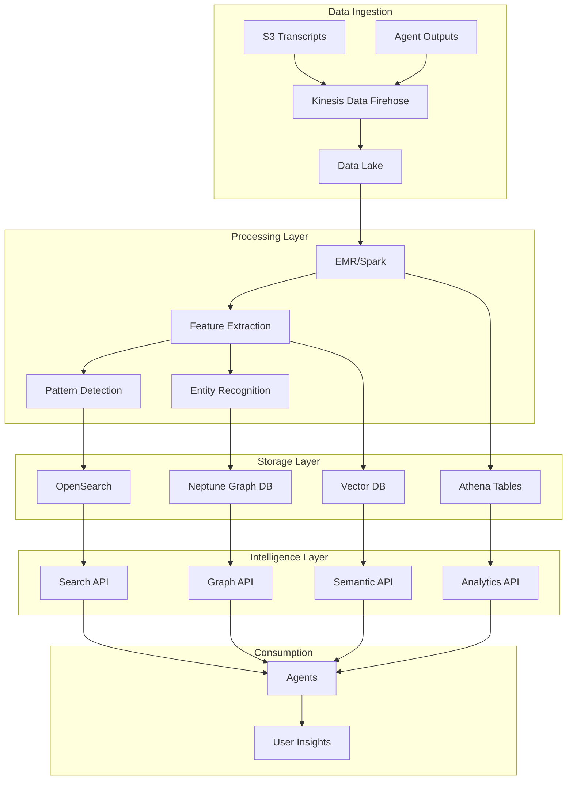

# [Discovery] EPIC-006: Discovery & Intelligence Infrastructure

## Why This Matters

WhisperSync accumulates thousands of voice transcripts containing invaluable patterns about user behavior, preferences, and growth. Without discovery infrastructure, these insights remain buried in isolated S3 objects. The Discovery & Intelligence system transforms raw transcripts into:

- **Behavioral Insights**: "You're 3x more productive on Tuesdays"
- **Emerging Patterns**: "Family mentions increased 40% this month"  
- **Predictive Suggestions**: "Based on your patterns, schedule deep work before 10 AM"
- **Cross-Agent Learning**: Connect dots between work stress and personal memories

This infrastructure is the foundation for WhisperSync's evolution from a reactive tool to a proactive cognitive companion.

## Acceptance Criteria

### 1. Search Infrastructure
- [ ] Full-text search across all transcripts and outputs
- [ ] Semantic search using vector embeddings
- [ ] Faceted search by date, agent, emotion, topics
- [ ] Sub-second query response time
- [ ] Search API accessible to all agents

### 2. Pattern Detection Engine
- [ ] Automated pattern discovery across time windows
- [ ] Anomaly detection for behavioral changes
- [ ] Trend analysis with statistical significance
- [ ] Custom pattern definitions via rules
- [ ] Real-time pattern alerts

### 3. Knowledge Graph
- [ ] Entity extraction (people, places, projects, concepts)
- [ ] Relationship mapping between entities
- [ ] Temporal evolution tracking
- [ ] Graph traversal queries
- [ ] Visual graph exploration interface

### 4. Analytics Pipeline
- [ ] Daily/weekly/monthly aggregations
- [ ] Custom metrics computation
- [ ] A/B testing framework for agents
- [ ] Performance benchmarking
- [ ] Export capabilities for analysis

### 5. Intelligence APIs
- [ ] RESTful API for search queries
- [ ] GraphQL endpoint for complex queries
- [ ] Streaming API for real-time insights
- [ ] Batch processing for historical analysis
- [ ] Rate limiting and authentication

## Technical Approach

### Architecture Overview



### Search Infrastructure Design

#### OpenSearch Implementation
```python
class DiscoveryEngine:
    def __init__(self):
        self.opensearch = OpenSearchClient()
        self.vector_store = Pinecone()
        self.graph_db = NeptuneClient()
        
    async def hybrid_search(self, query: str, filters: dict = None):
        """Combine keyword and semantic search."""
        # Keyword search in OpenSearch
        keyword_results = await self.opensearch.search(
            index="transcripts",
            body={
                "query": {
                    "multi_match": {
                        "query": query,
                        "fields": ["content^2", "summary", "themes"]
                    }
                },
                "aggs": {
                    "emotions": {"terms": {"field": "emotion"}},
                    "agents": {"terms": {"field": "agent_type"}},
                    "dates": {"date_histogram": {"field": "timestamp"}}
                }
            }
        )
        
        # Semantic search in vector store
        embedding = await self.generate_embedding(query)
        semantic_results = await self.vector_store.query(
            vector=embedding,
            top_k=20,
            filter=filters
        )
        
        # Merge and re-rank results
        return self.merge_results(keyword_results, semantic_results)
```

### Pattern Detection Algorithms

```python
class PatternDetector:
    def __init__(self):
        self.algorithms = {
            'frequency': FrequencyAnalyzer(),
            'anomaly': IsolationForest(),
            'trend': ProphetForecaster(),
            'correlation': CorrelationMatrix()
        }
    
    def detect_patterns(self, time_window: str = '30d'):
        patterns = []
        
        # Frequency patterns
        patterns.extend(
            self.find_recurring_themes(time_window)
        )
        
        # Behavioral anomalies
        patterns.extend(
            self.detect_anomalies(time_window)
        )
        
        # Trend analysis
        patterns.extend(
            self.analyze_trends(time_window)
        )
        
        # Cross-agent correlations
        patterns.extend(
            self.find_correlations()
        )
        
        return self.rank_patterns_by_significance(patterns)
    
    def find_recurring_themes(self, window: str):
        """Identify topics that appear regularly."""
        return self.algorithms['frequency'].analyze(
            data=self.load_transcripts(window),
            min_frequency=3,
            min_confidence=0.7
        )
```

### Knowledge Graph Schema

```cypher
// Entities
CREATE (u:User {id: 'user_123', name: 'William'})
CREATE (m:Memory {id: 'mem_456', content: '...', emotion: 'nostalgic'})
CREATE (p:Person {name: 'Dad', relationship: 'father'})
CREATE (proj:Project {name: 'habit-tracker', type: 'github'})
CREATE (t:Theme {name: 'family', category: 'personal'})

// Relationships
CREATE (u)-[:CREATED]->(m)
CREATE (m)-[:MENTIONS]->(p)
CREATE (m)-[:OCCURRED_AT]->(time:TimePoint {date: '2024-01-15'})
CREATE (m)-[:HAS_THEME]->(t)
CREATE (u)-[:WORKING_ON]->(proj)
CREATE (proj)-[:INSPIRED_BY]->(m)

// Queries
// Find all memories about family from last month
MATCH (u:User)-[:CREATED]->(m:Memory)-[:HAS_THEME]->(t:Theme {name: 'family'})
WHERE m.timestamp > datetime() - duration('P30D')
RETURN m ORDER BY m.timestamp DESC

// Find connections between work stress and family memories
MATCH (work:Memory)-[:HAS_THEME]->(stress:Theme {name: 'stress'}),
      (work)-[:OCCURRED_AT]->(t1:TimePoint),
      (family:Memory)-[:HAS_THEME]->(fam:Theme {name: 'family'}),
      (family)-[:OCCURRED_AT]->(t2:TimePoint)
WHERE abs(duration.between(t1.date, t2.date).days) < 2
RETURN work, family, t1, t2
```

### Analytics Pipeline

```python
class AnalyticsPipeline:
    def __init__(self):
        self.spark = SparkSession.builder.appName("WhisperSync").getOrCreate()
        
    def daily_aggregation(self, date: str):
        """Compute daily metrics."""
        df = self.spark.read.parquet(f"s3://data-lake/transcripts/{date}")
        
        metrics = {
            'total_transcripts': df.count(),
            'unique_themes': df.select('themes').distinct().count(),
            'emotion_distribution': df.groupBy('emotion').count().collect(),
            'agent_usage': df.groupBy('agent_type').count().collect(),
            'avg_sentiment': df.agg({'sentiment_score': 'avg'}).collect()[0][0]
        }
        
        # Pattern detection
        patterns = self.detect_daily_patterns(df)
        
        # Write results
        self.write_metrics(date, metrics, patterns)
```

## Testing Scenarios

### 1. Search Accuracy Test
```
Query: "conversations about productivity with my manager"
Expected Results:
- Transcripts mentioning manager AND productivity
- Ranked by relevance and recency
- Highlighted snippets showing context
- Related themes and emotions
```

### 2. Pattern Detection Test
```
Input: 30 days of transcripts
Expected Patterns:
- "Mentions of 'deadline' spike on Thursdays"
- "Family-related memos increase on weekends"
- "Productivity themes correlate with morning memos"
- "Stress levels higher in project-tagged memos"
```

### 3. Knowledge Graph Test
```
Query: Show evolution of "AI project" mentions
Expected:
- Timeline of AI project references
- Connected people and themes
- Emotional journey (excited → frustrated → accomplished)
- Related GitHub repos created
```

### 4. Real-time Intelligence Test
```
Scenario: User exhibits unusual pattern
Expected:
- Anomaly detected within 5 minutes
- Alert generated with context
- Suggested agent interventions
- Pattern stored for future reference
```

## Dependencies

### Infrastructure Dependencies
- Amazon OpenSearch Service
- Amazon Neptune (Graph DB)
- Vector database (Pinecone/Weaviate)
- Amazon EMR for batch processing
- Kinesis for streaming ingestion

### Technical Dependencies
- Embedding model for semantic search
- NLP libraries for entity extraction
- Time series analysis frameworks
- Graph algorithms library

## Effort Estimation

### Development Tasks
- Search infrastructure setup: 5 days
- Pattern detection engine: 8 days
- Knowledge graph implementation: 6 days
- Analytics pipeline: 4 days
- API development: 5 days
- Testing and tuning: 4 days

**Total: 32 days**

### Operational Tasks
- Infrastructure provisioning: 3 days
- Data migration: 2 days
- Performance optimization: 3 days
- Documentation: 2 days

**Total Additional: 10 days**

### Risk Factors
- OpenSearch cluster sizing and costs
- Complex pattern detection algorithms
- Graph database performance at scale
- Privacy considerations for pattern sharing

## Labels

- `epic`
- `infrastructure`
- `priority-high`
- `size-xxl`
- `backend`
- `data-engineering`
- `ml-required`

## Success Metrics

### Search Performance
- < 100ms search response time
- > 90% search relevance score
- Support for 1000+ concurrent queries
- < 1% search failures

### Pattern Quality
- > 80% pattern accuracy
- < 10% false positive rate
- Detect 90% of significant behavioral changes
- Generate 5+ actionable insights daily

### System Scale
- Index 1M+ transcripts
- Store 10M+ graph relationships
- Process 100K+ daily transcripts
- Maintain 30-day rolling analytics

### Business Impact
- 50%+ increase in user engagement
- 30%+ improvement in agent response relevance
- 10+ new use cases enabled
- 90%+ user satisfaction with insights

## Architecture Decision Record (ADR)

**Decision**: Use OpenSearch for search, Neptune for graph, and custom ML for patterns

**Context**: Need scalable infrastructure for search, relationships, and intelligence

**Consequences**:
- (+) Best-in-class tools for each use case
- (+) Managed services reduce operational burden
- (+) Proven scale and performance
- (-) Multiple systems to integrate
- (-) Higher complexity and costs

**Alternatives Considered**:
- Elasticsearch + Neo4j
- Single solution (Dgraph)
- Build custom search/graph engine