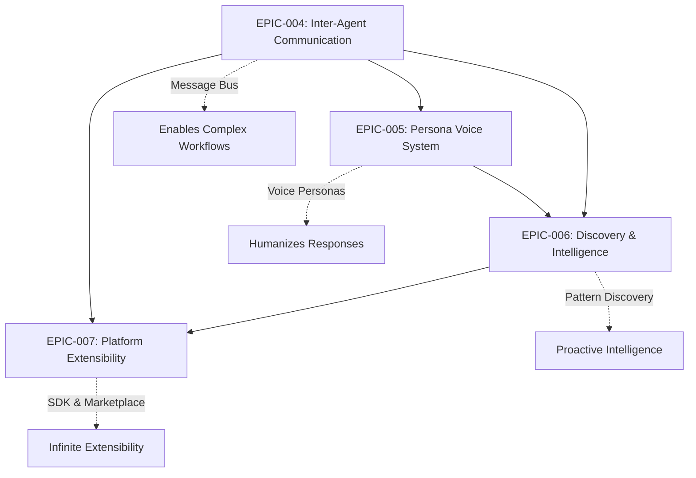

# WhisperSync Infrastructure Epics Summary

## Overview

These four infrastructure epics represent the evolution of WhisperSync from a simple voice-to-action tool into a comprehensive AI platform. Each epic builds upon the previous, creating a coherent architecture for intelligent voice processing.

## Epic Relationships

## Implementation Order

### Phase 1: Foundation (EPIC-004)
**Inter-Agent Communication** must come first as it enables:
- Coordinated multi-agent workflows
- Shared intelligence between agents
- Event-driven architecture for all future features

### Phase 2: User Experience (EPIC-005)
**Persona Voice System** builds on communication to:
- Create consistent voice across all agents
- Share emotional context between agents
- Enable persona-aware responses

### Phase 3: Intelligence (EPIC-006)
**Discovery & Intelligence** leverages both previous epics:
- Analyzes patterns across all agent communications
- Provides insights that inform persona selection
- Enables predictive and proactive features

### Phase 4: Ecosystem (EPIC-007)
**Platform Extensibility** requires all infrastructure:
- Third-party agents use the message bus
- Custom agents inherit persona capabilities
- SDK includes discovery/search APIs

## Key Technical Decisions

### 1. Message Bus Architecture
- **Choice**: Amazon EventBridge
- **Why**: Native AWS integration, schema registry, powerful routing
- **Impact**: All agents must implement event publishing/subscribing

### 2. Search Infrastructure  
- **Choice**: OpenSearch + Neptune + Vector DB
- **Why**: Best-in-class for each use case (text, graph, semantic)
- **Impact**: Higher complexity but maximum capability

### 3. Persona Implementation
- **Choice**: Rule-based selection with Claude generation
- **Why**: Consistent voices with fast selection
- **Impact**: Careful prompt engineering required

### 4. SDK Language
- **Choice**: Python first, TypeScript planned
- **Why**: Python dominates AI/ML ecosystem
- **Impact**: May limit some web developers initially

## Resource Requirements

### Development Team
- **EPIC-004**: 16 days (Backend focus)
- **EPIC-005**: 25 days (AI/UX focus)
- **EPIC-006**: 42 days (Data engineering focus)
- **EPIC-007**: 57 days (Platform/DevX focus)

**Total: 140 development days** (approximately 7 months with a small team)

### Infrastructure Costs (Monthly Estimates)

#### EPIC-004: Inter-Agent Communication
- EventBridge: $50-100 (based on events)
- SQS/DLQ: $20-40
- CloudWatch: $30-50
- **Subtotal: $100-190**

#### EPIC-005: Persona Voice System  
- Amazon Polly: $200-400 (based on usage)
- Additional Claude tokens: $100-200
- **Subtotal: $300-600**

#### EPIC-006: Discovery & Intelligence
- OpenSearch cluster: $300-600
- Neptune instance: $200-400
- Vector DB: $100-200
- EMR processing: $100-300
- **Subtotal: $700-1500**

#### EPIC-007: Platform Extensibility
- ECS/Fargate for sandboxing: $200-500
- API Gateway: $50-100
- DynamoDB: $50-100
- S3 storage: $50-100
- **Subtotal: $350-800**

**Total Monthly Infrastructure: $1,450-3,090**

## Risk Mitigation

### Technical Risks
1. **Integration Complexity**: Mitigate with comprehensive testing
2. **Performance at Scale**: Start with conservative limits, optimize later
3. **Security Vulnerabilities**: Regular audits and penetration testing
4. **Cost Overruns**: Implement cost alerts and auto-scaling limits

### Business Risks
1. **Developer Adoption**: Focus on exceptional documentation
2. **Marketplace Quality**: Implement strict review process
3. **User Privacy**: Clear data policies and user controls
4. **Platform Lock-in**: Design with portability in mind

## Success Metrics Summary

### User Impact
- 10x increase in use cases covered
- 50% increase in daily active users
- 90% user satisfaction with intelligence features
- 4.5+ star rating for voice quality

### Technical Excellence  
- < 100ms message delivery latency
- < 500ms search response time
- 99.9% platform availability
- Zero security breaches

### Business Growth
- 100+ third-party agents created
- $10K+ monthly marketplace revenue
- 40% reduction in feature requests
- 5+ enterprise deployments

## Next Steps

1. **Architecture Review**: Validate technical decisions with team
2. **Prototype Phase**: Build proof-of-concepts for risky components
3. **Detailed Planning**: Break epics into 2-week sprints
4. **Team Formation**: Assign dedicated engineers per epic
5. **Begin EPIC-004**: Start with EventBridge message bus

## Conclusion

These four epics transform WhisperSync into a platform that:
- **Thinks**: Agents communicate and coordinate
- **Feels**: Personas provide emotional intelligence
- **Learns**: Discovery surfaces insights and patterns
- **Grows**: Extensibility enables infinite possibilities

The journey from voice memo tool to cognitive exoskeleton platform is ambitious but achievable with proper planning and execution.