# WhisperSync Enhanced Architecture Diagram

## High-Level Architecture


## Detailed Component Flow


## Security Architecture


## Cost Optimization Flow


## Scalability Architecture


## Theory of Mind Data Model

```mermaid
erDiagram
    USER ||--o{ TRANSCRIPT : creates
    USER ||--o{ PREFERENCE : has
    USER ||--o{ CONTEXT : maintains
    
    TRANSCRIPT ||--o{ PROCESSING : undergoes
    PROCESSING ||--|| AGENT : "handled by"
    PROCESSING ||--o{ MEMORY_CHAIN : creates
    
    AGENT ||--o{ THEORY_OF_MIND : updates
    THEORY_OF_MIND ||--|| USER : "about"
    
    MEMORY_CHAIN ||--o{ MEMORY_NODE : contains
    MEMORY_NODE ||--|| EMBEDDING : has
    
    USER {
        string user_id PK
        string email
        timestamp created_at
        json preferences
    }
    
    TRANSCRIPT {
        string transcript_id PK
        string user_id FK
        string content
        string agent_type
        timestamp created_at
    }
    
    THEORY_OF_MIND {
        string user_id PK
        timestamp updated_at SK
        json user_context
        json preferences
        json behavioral_patterns
        json communication_style
    }
    
    MEMORY_CHAIN {
        string chain_id PK
        number sequence SK
        string content
        json metadata
        timestamp created_at
    }
```

## Monitoring Dashboard Layout

```mermaid
graph TB
    subgraph "Executive Dashboard"
        KPI1[Total Transcripts<br/>Today]
        KPI2[Success Rate<br/>99.5%]
        KPI3[Avg Processing Time<br/>2.3s]
        KPI4[System Health<br/>✅]
    end
    
    subgraph "Technical Metrics"
        subgraph "Lambda Performance"
            Invocations[Invocation Rate]
            Errors[Error Rate]
            Duration[Duration P99]
            Concurrency[Concurrent Executions]
        end
        
        subgraph "Queue Health"
            QueueDepth[Queue Depth]
            MessageAge[Message Age]
            DLQ[DLQ Messages]
        end
        
        subgraph "Cost Tracking"
            DailyCost[Daily Cost]
            ProjectedMonthly[Projected Monthly]
            CostByService[Cost by Service]
        end
    end
    
    subgraph "Alerts & Actions"
        Critical[🔴 Critical Alerts]
        High[🟡 High Priority]
        Low[🟢 Low Priority]
        Runbooks[Automated Runbooks]
    end
```



## Deployment Pipeline


## Data Flow Summary

1. **Voice Input**: iPhone → Whisper → S3
2. **Event Processing**: S3 Event → Router Lambda → SQS
3. **Orchestration**: SQS → Orchestrator → Agent Queues
4. **Agent Processing**: Queue → Agent Lambda → External APIs
5. **Data Storage**: Agent → DynamoDB/S3
6. **Monitoring**: All components → CloudWatch/X-Ray

This architecture provides:
- **Reliability**: SQS queues with DLQ for guaranteed processing
- **Scalability**: Queue-based decoupling and auto-scaling
- **Security**: Multiple layers of encryption and access control
- **Observability**: Comprehensive monitoring and tracing
- **Cost Efficiency**: Pay-per-use with optimization strategies